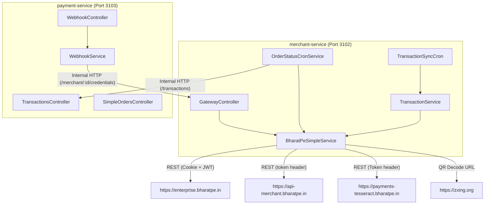
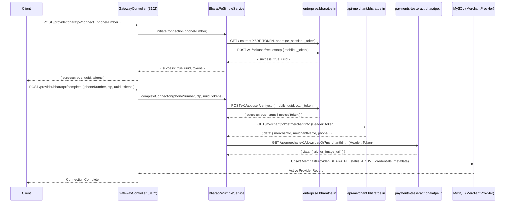
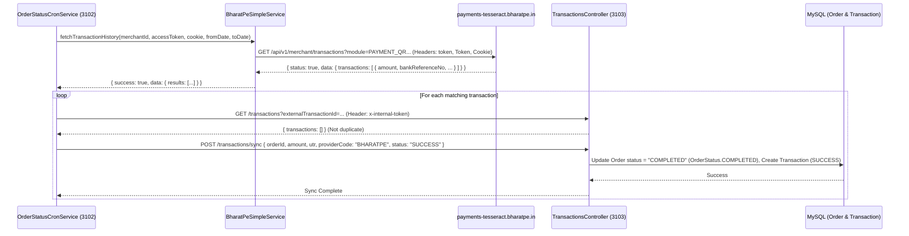
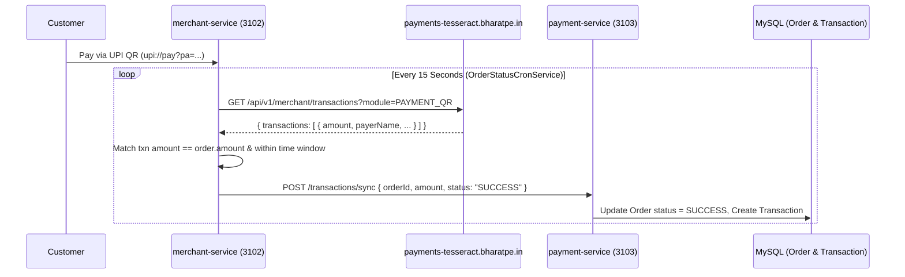

# UPipe Backend Provider Documentation: BharatPe (`BHARATPE.md`)

## 1. Executive Summary

The BharatPe integration in the UPipe backend allows merchants to connect their BharatPe business account to UPipe via an OTP-based authentication flow, retrieve their UPI QR / VPA ID, synchronize incoming UPI payment transactions, and reconcile pending orders. 

The integration involves two microservices:
* **`merchant-service`** (application port `3102`): Handles merchant onboarding, OTP request/verification against BharatPe's Enterprise API, merchant information and QR/UPI ID retrieval via the Tesseract API, transaction synchronization, and keep-alive scheduled jobs.
* **`payment-service`** (application port `3103`): Manages local order and transaction records, and provides an HTTP webhook endpoint (`POST /webhooks/bharatpe`) that verifies HMAC-SHA256 signatures before updating matching orders.



**Implemented Features:**
* OTP-based onboarding and authentication (`requestotp` and `verifyotp` on `enterprise.bharatpe.in`).
* Automated extraction of the merchant's UPI VPA by downloading the merchant QR image URL from `payments-tesseract.bharatpe.in` and decoding it via `zxing.org`.
* Polling transaction history via `https://payments-tesseract.bharatpe.in/api/v1/merchant/transactions?module=PAYMENT_QR`.
* Webhook processing with HMAC-SHA256 verification and timing-safe signature comparison.
* Order reconciliation matching pending orders against fetched transactions by exact fractional amount or UTR.
* Keep-alive cron (`0 */15 * * * *`) that fetches a 1-minute transaction window to keep the session active.

**Absent Features:**
* No direct provider API call is made to initiate or create an individual order on BharatPe; payment intents are generated as local `upi://pay?pa=...` URIs or QR codes using the merchant's retrieved UPI ID.
* No browser automation (Puppeteer/Playwright) is used for BharatPe onboarding or synchronization (all interactions use direct HTTP REST calls via `axios`).

---

## 2. Relevant Files

| Exact File Path | Class / Function | Provider Responsibility | Called By | Calls / Dependencies |
| :--- | :--- | :--- | :--- | :--- |
| `merchant-service/src/modules/provider/bharatpe-simple.service.ts` | `BharatPeSimpleService` | Executes OTP requests, token extraction, merchant profile lookup, QR download/decoding, transaction history fetching, and session keep-alive cron. | `ProviderConnectionService`, `OrderStatusCronService`, `TransactionService` | `axios`, `PrismaService`, `https://enterprise.bharatpe.in`, `https://api-merchant.bharatpe.in`, `https://payments-tesseract.bharatpe.in`, `https://zxing.org` |
| `merchant-service/src/modules/provider/provider-connection.service.ts` | `ProviderConnectionService.connectBharatPeSimple`, `completeBharatPeSimple` | Orchestrates multi-step onboarding, saves/updates `MerchantProvider` records with provider enum `BHARATPE`. | `GatewayController` | `BharatPeSimpleService`, `PrismaService` |
| `merchant-service/src/modules/provider/gateway.controller.ts` | `GatewayController.connectBharatPe`, `completeBharatPeConnection` | Exposes HTTP endpoints for initiating and completing BharatPe OTP connection. | Client / API Gateway | `ProviderConnectionService` |
| `merchant-service/src/modules/transaction/order-status-cron.service.ts` | `OrderStatusCronService.checkBharatPeOrdersForMerchant`, `handleBharatPeTransactionMatch` | Periodically reconciles pending `BHARATPE` orders against provider transaction history. | `checkPendingOrders` cron (`5,20,35,50 * * * * *`) | `BharatPeSimpleService.fetchTransactionHistory`, `axios` internal REST calls to `payment-service` |
| `merchant-service/src/modules/transaction/transaction.service.ts` | `TransactionService.syncTransactions` | Invokes `BharatPeSimpleService.fetchTransactionHistory` and normalizes transactions. | `TransactionSyncCron`, `OrderStatusCronService` | `BharatPeSimpleService`, `PrismaService` |
| `merchant-service/src/modules/transaction/transaction-sync.cron.ts` | `TransactionSyncCron.syncRecentTransactions`, `syncHistoricalTransactions`, `syncFullHistoryTransactions`, `checkProviderHealth` | Background cron schedules that trigger synchronization for merchants with `BHARATPE` providers. | NestJS Scheduler | `TransactionService` |
| `payment-service/src/controllers/webhook.controller.ts` | `WebhookController.handleBharatPeWebhook` | Receives incoming POST webhook notifications at `/webhooks/bharatpe`. | API Gateway / External Webhook | `WebhookService.handleBharatPeWebhook` |
| `payment-service/src/services/webhook.service.ts` | `WebhookService.handleBharatPeWebhook`, `verifyBharatPeSignature`, `parseBharatPeWebhook` | Verifies webhook HMAC-SHA256 signature using `timingSafeEqual`, parses payload, and updates `Order`. | `WebhookController` | `PrismaService`, `crypto.createHmac`, `crypto.timingSafeEqual` |
| `payment-service/src/controllers/transactions.controller.ts` | `TransactionsController.syncTransactions` | Receives internal REST synchronization calls to record transactions and match orders. | `merchant-service` (`OrderStatusCronService`, `TransactionService`) | `PrismaService` |
| `payment-service/src/controllers/simple-orders.controller.ts` | `SimpleOrdersController.createOrder` | Creates local orders with `providerType = "BHARATPE"`. | API Gateway / Client | `PrismaService` |
| `merchant-service/prisma/schema.prisma` | `MerchantProvider`, `ProviderType` (`BHARATPE`), `MerchantProviderStatus` | MySQL database schema defining provider types, statuses, and JSON credential storage. | Prisma ORM | MySQL |

---

## 3. Service Ports and Module Registration

* **Application Fallback Ports (Reference: [`SHARED_BACKEND_FACTS.md`](file:///upipe_backend/docs/providers/SHARED_BACKEND_FACTS.md)):**
  * `api-gateway`: `3100` (`process.env.PORT`, default `3100` in `.env.example`/README).
  * `identity-service`: `3101` (`process.env.PORT || 3101`).
  * `merchant-service`: `3102` (`process.env.PORT || 3102` in `merchant-service/src/main.ts`).
  * `payment-service`: `3103` (`process.env.PORT || 3103` in `payment-service/src/main.ts`).
  * `subscription-service`: `3105` (`process.env.PORT || 3105` in `subscription-service/src/main.ts`).
  * `organization-service`: `3106` (`process.env.PORT || 3106`).
  * `notification-service`: `3006` (`process.env.PORT || 3006`).
* **Global Prefixes:** Both services register a global prefix of `/` or specific controller route paths.
* **Module Registration:**
  * In `merchant-service`, `BharatPeSimpleService` is registered as an injectable provider in `ProviderModule` and exported for injection into `TransactionModule`.
  * `ScheduleModule.forRoot()` is registered in `AppModule` to enable `@Cron()` decorators across services.

---

## 4. Public, Internal, and External Routes

| Route Type | Method | Exact Path | Owning Service | Controller / Function | Authentication |
| :--- | :--- | :--- | :--- | :--- | :--- |
| API Gateway Route | `POST` | `/api/v1/merchants/bharatpe/connect` | `api-gateway` | Proxied to `merchant-service` | JWT Auth Guard |
| API Gateway Route | `POST` | `/api/v1/merchants/bharatpe/complete` | `api-gateway` | Proxied to `merchant-service` | JWT Auth Guard |
| API Gateway Route | `POST` | `/api/v1/webhooks/bharatpe` | `api-gateway` | Proxied to `payment-service` (`/webhooks/bharatpe`) | Public (Signature Verified) |
| Downstream Service Route | `POST` | `/provider/bharatpe/connect` | `merchant-service` | `GatewayController.connectBharatPe` | Auth Guard / Merchant Guard |
| Downstream Service Route | `POST` | `/provider/bharatpe/complete` | `merchant-service` | `GatewayController.completeBharatPeConnection` | Auth Guard / Merchant Guard |
| Downstream Service Route | `POST` | `/webhooks/bharatpe` | `payment-service` | `WebhookController.handleBharatPeWebhook` | Public (HMAC-SHA256 Verified) |
| Internal REST Route | `GET` | `/transactions?externalTransactionId=:id` | `payment-service` | `TransactionsController` | `x-internal-token` header |
| Internal REST Route | `POST` | `/merchant/:id/credentials` | `merchant-service` | `GatewayController.getMerchantCredentials` | `x-internal-token` header |
| External Provider API | `GET` | `https://enterprise.bharatpe.in/` | External (BharatPe) | `BharatPeSimpleService.fetchTokensAndCsrf` | None (Fetches CSRF & session cookies) |
| External Provider API | `POST` | `https://enterprise.bharatpe.in/v1/api/user/requestotp` | External (BharatPe) | `BharatPeSimpleService.sendOtp` | `XSRF-TOKEN` and `bharatpe_session` cookies |
| External Provider API | `POST` | `https://enterprise.bharatpe.in/v1/api/user/verifyotp` | External (BharatPe) | `BharatPeSimpleService.verifyOtp` | `XSRF-TOKEN`, `bharatpe_session`, `uuid`, `otp` |
| External Provider API | `GET` | `https://api-merchant.bharatpe.in/merchant/v3/getmerchantinfo` | External (BharatPe) | `BharatPeSimpleService.getMerchantInfo` | `token: accessToken` header |
| External Provider API | `GET` | `https://payments-tesseract.bharatpe.in/api/merchant/v1/downloadQr?merchantId=:id` | External (BharatPe) | `BharatPeSimpleService.getUpiId` | `Token: accessToken` header |
| External Provider API | `GET` | `https://payments-tesseract.bharatpe.in/api/v1/merchant/transactions` | External (BharatPe) | `BharatPeSimpleService.fetchTransactionHistory` | `token` / `Token` header, optional `Cookie` |

---

## 5. Integration Modes

`No explicit provider integration-mode selection mechanism was found in the current codebase.`

BharatPe is implemented via a single unified OTP-based API integration in `BharatPeSimpleService`:
* **Onboarding Branch:** Uses OTP requests against `https://enterprise.bharatpe.in` to obtain a bearer JWT access token.
* **Merchant & QR Branch:** Uses the access token against `https://api-merchant.bharatpe.in` (profile) and `https://payments-tesseract.bharatpe.in` (QR image download and decoding).
* **Transaction Fetching Branch:** Calls `https://payments-tesseract.bharatpe.in/api/v1/merchant/transactions?module=PAYMENT_QR` using the access token in both `token` and `Token` headers.

---

## 6. Merchant Onboarding and Connection Flow

1. **Initiate Connection (`POST /provider/bharatpe/connect`):**
   * Client sends `{ phoneNumber: "9876543210" }`.
   * `GatewayController.connectBharatPe` calls `ProviderConnectionService.connectBharatPeSimple`.
   * `BharatPeSimpleService.initiateConnection` calls `fetchTokensAndCsrf()` to make an HTTP GET to `https://enterprise.bharatpe.in/`, extracting `_token` from HTML and `XSRF-TOKEN` and `bharatpe_session` from `Set-Cookie` headers.
   * Calls `sendOtp()`, posting form data (`mobile`, `_token`) to `https://enterprise.bharatpe.in/v1/api/user/requestotp`.
   * Returns `{ success: true, uuid: "...", tokens: { ... } }` to the client.
2. **Complete Connection (`POST /provider/bharatpe/complete`):**
   * Client sends `{ phoneNumber, otp, uuid, tokens }`.
   * `BharatPeSimpleService.completeConnection` calls `verifyOtp()`, posting form data (`mobile`, `uuid`, `otp`, `_token`) to `https://enterprise.bharatpe.in/v1/api/user/verifyotp`, receiving `accessToken`.
   * Calls `getMerchantInfo(accessToken)` against `https://api-merchant.bharatpe.in/merchant/v3/getmerchantinfo` to extract `merchantId`, `merchantName`, and `phone`.
   * Calls `getUpiId(merchantId, accessToken)` against `https://payments-tesseract.bharatpe.in/api/merchant/v1/downloadQr?merchantId=...` to obtain the QR image URL. It decodes the QR URL via `https://zxing.org/w/decode?u=...` to extract `upi://pay?pa=...`. If extraction fails, it falls back to `BHARATPE.${merchantId}@fbpe`.
   * Persists or updates `MerchantProvider` in MySQL with `providerType = "BHARATPE"`, `status = "ACTIVE"`, `credentials = { merchantId, accessToken, phone, cookie: "XSRF-TOKEN=...; bharatpe_session=..." }`, and `metadata = { upiId, merchantName, phone }`.



---

## 7. Credential and Session Storage

* **Prisma Model & Schema Owner:** `MerchantProvider` in `merchant-service/prisma/schema.prisma`.
* **Provider Enum:** `ProviderType.BHARATPE`.
* **Provider Status Enum:** `MerchantProviderStatus.ACTIVE` (`INACTIVE`, `ERROR`, etc.).

### Automatically Stored During Onboarding

```json
{
  "credentials": {
    "merchantId": "12345678",
    "accessToken": "eyJ0eXAiOiJKV1QiLCJhbGciOiJIUzI1NiJ9...",
    "phone": "9876543210",
    "cookie": "XSRF-TOKEN=xxx; bharatpe_session=yyy"
  },
  "metadata": {
    "upiId": "merchant.vpa@fbpe",
    "merchantName": "Sample Merchant Business",
    "phone": "9876543210"
  }
}
```

### Optionally or Manually Configured

```json
{
  "credentials": {
    "webhookSecret": "whsec_sample_secret_key"
  },
  "metadata": {
    "authError": "UNAUTHORIZED",
    "authExpiredAt": "2026-07-31T01:40:00.000Z"
  }
}
```

`No application-level encryption of BHARATPE credentials was found in the inspected code paths.` Credentials are stored as plain JSON in MySQL.

---

## 8. Database Ownership

| Model | Owning Service | Prisma Schema | Accessed By Provider Component | Access Method |
| :--- | :--- | :--- | :--- | :--- |
| `MerchantProvider` | `merchant-service` | `merchant-service/prisma/schema.prisma` | `BharatPeSimpleService`, `ProviderConnectionService`, `OrderStatusCronService` | Local Prisma (`this.prisma.merchantProvider`) |
| `Order` | `payment-service` | `payment-service/prisma/schema.prisma` | `WebhookService` (`handleBharatPeWebhook`, `verifyBharatPeSignature`), `SimpleOrdersController` | Local Prisma (`this.prisma.order`) |
| `Transaction` | `payment-service` | `payment-service/prisma/schema.prisma` | `TransactionsController.syncTransactions` | Local Prisma (`this.prisma.transaction`) |
| `PaymentLink` | `payment-service` | `payment-service/prisma/schema.prisma` | Not used by BharatPe provider | Not used |
| `CallbackLog` | `payment-service` | `payment-service/prisma/schema.prisma` | `WebhookService` | Local Prisma (`this.prisma.callbackLog`) |

---

## 9. Environment Variables

| Variable | Service | Exact Source File | Parsed Type | Default | Required? | Behaviour When Missing |
| :--- | :--- | :--- | :--- | :--- | :--- | :--- |
| `PORT` | `merchant-service`, `payment-service` | `src/main.ts` | `number` | `3102`, `3103` | No | Uses fallback port (`3102` or `3103`) |
| `PAYMENT_SERVICE_URL` | `merchant-service` | `order-status-cron.service.ts` | `string` | `http://localhost:3103` | No | HTTP requests default to `http://localhost:3103` |
| `INTERNAL_TOKEN` | `merchant-service`, `payment-service` | `order-status-cron.service.ts`, `webhook.service.ts` | `string` | `""` | No | Sends empty string in `x-internal-token` header |
| `BHARATPE_WEBHOOK_SECRET` | `payment-service` | `webhook.service.ts` | `string` | `undefined` | No (if present in credentials) | Falls back to merchant credential `webhookSecret` |

---

## 10. External Provider Requests

| Action | Method | Exact URL | Headers | Request Body | Calling Function | Timeout | Error Handling |
| :--- | :--- | :--- | :--- | :--- | :--- | :--- | :--- |
| Fetch CSRF & Session | `GET` | `https://enterprise.bharatpe.in/` | `User-Agent`, `Accept` | None | `fetchTokensAndCsrf` | Default (`axios`) | Throws `BadRequestException("Failed to connect to BharatPe...")` |
| Request OTP | `POST` | `https://enterprise.bharatpe.in/v1/api/user/requestotp` | `Content-Type: application/x-www-form-urlencoded`, `X-Requested-With: XMLHttpRequest`, `Cookie` | `mobile=&_token=` | `sendOtp` | Default (`axios`) | Throws `BadRequestException` on `success === false` or HTTP error |
| Verify OTP | `POST` | `https://enterprise.bharatpe.in/v1/api/user/verifyotp` | `Content-Type: application/x-www-form-urlencoded`, `X-Requested-With: XMLHttpRequest`, `Cookie` | `mobile=&uuid=&otp=&_token=` | `verifyOtp` | Default (`axios`) | Throws `BadRequestException` on `success === false` or missing token |
| Get Merchant Info | `GET` | `https://api-merchant.bharatpe.in/merchant/v3/getmerchantinfo` | `Accept`, `token: accessToken`, `Origin`, `Referer` | None | `getMerchantInfo` | Default (`axios`) | Throws `BadRequestException` on failure |
| Download QR | `GET` | `https://payments-tesseract.bharatpe.in/api/merchant/v1/downloadQr?merchantId=:id` | `Accept`, `Token: accessToken` | None | `getUpiId` | Default (`axios`) | Falls back to `BHARATPE.${merchantId}@fbpe` on error |
| Decode QR | `GET` | `https://zxing.org/w/decode?u=:qrUrl` | `User-Agent` | None | `getUpiId` | Default (`axios`) | Falls back to `BHARATPE.${merchantId}@fbpe` if decode fails |
| Fetch Transactions | `GET` | `https://payments-tesseract.bharatpe.in/api/v1/merchant/transactions?module=PAYMENT_QR&merchantId=:id&sDate=:from&eDate=:to` | `token: accessToken`, `Token: accessToken`, `Cookie: cookie`, `Accept` | None | `fetchTransactionHistory` | `120000ms` (`120s`) | Returns `{ success: false, authError: true, error: "BHARATPE_AUTH_EXPIRED" }` on HTTP 401 |

---

## 11. Payment, UPI Intent, and QR Generation

* **No External Payment API Call:** UPipe does not call a BharatPe API to create an order or payment request.
* **Local UPI URI Creation:** When an order is created with `providerType = "BHARATPE"`, the application constructs a standard UPI payment URI (`upi://pay?pa=<upiId>&pn=<merchantName>&am=<amount>&tr=<orderId>`) using the merchant's stored `upiId`.
* **QR Extraction & Fallback:**
  * During onboarding, `getUpiId` downloads the merchant's QR image URL from `https://payments-tesseract.bharatpe.in/api/merchant/v1/downloadQr?merchantId=<merchantId>`.
  * It sends this URL to `https://zxing.org/w/decode?u=<qrUrl>` and parses the decoded HTML with `/upi:\/\/pay\?pa=([^&]+)/`.
  * If decoding fails or no QR URL is returned, UPipe assigns a fallback VPA pattern: `BHARATPE.<merchantId>@fbpe`.

---

## 12. Transaction Fetching and Synchronization

* **Source Endpoint:** `GET https://payments-tesseract.bharatpe.in/api/v1/merchant/transactions?module=PAYMENT_QR&merchantId=<id>&sDate=<YYYY-MM-DD>&eDate=<YYYY-MM-DD>`.
* **Authentication:** Passes the JWT access token in both lowercase (`token`) and uppercase (`Token`) HTTP headers, along with optional cookie strings (`Cookie: XSRF-TOKEN=...`).
* **Response Parsing:**
  * Expects `status === true && message === "SUCCESS"`.
  * Extracts transaction records array from `data.transactions`.
  * Extracts fields: `amount`, `payerName`, `payerHandle`, `bankReferenceNo` or `internalUtr` (for UTR), and `paymentTimestamp` / `transactionDate` / `paymentDate` / `createdAt`.
* **Database Synchronization:**
  * In `TransactionService.syncTransactions`, fetched transactions are normalized and sent over internal REST (`POST ${PAYMENT_SERVICE_URL}/transactions/sync`) to `payment-service`.
  * In `payment-service`, `TransactionsController.syncTransactions` writes to the `Transaction` table in MySQL.



---

## 13. Webhook and Callback Processing

* **Webhook Existence:** Verified. `WebhookController.handleBharatPeWebhook` listens on `POST /webhooks/bharatpe` in `payment-service` (Port `3103`).
* **Gateway Proxy:** Proxied by `api-gateway` from `/webhooks/bharatpe` to downstream `payment-service`.
* **Signature Verification (`verifyBharatPeSignature`):**
  * Reads header `x-verify` or `x-signature`.
  * Resolves `secret` by checking `configService.get('BHARATPE_WEBHOOK_SECRET')` first, or fetching merchant credentials via internal REST (`POST /merchant/:id/credentials`) to read `credentials.webhookSecret`.
  * Computes `crypto.createHmac('sha256', secret).update(JSON.stringify(payload)).digest('hex')`.
  * Compares signatures using `crypto.timingSafeEqual(Buffer.from(computed), Buffer.from(signature))`.
* **Payload Parsing (`parseBharatPeWebhook`):**
  * Maps `payload.orderId` -> `orderId`.
  * Maps `payload.status === 'SUCCESS' ? 'SUCCESS' : 'FAILED'` -> `status`.
  * Maps `parseFloat(payload.amount)` -> `amount`.
  * Sets `paymentMethod: 'BHARATPE'`.
* **Order Update (`updateOrderFromWebhook`):**
  * Finds `Order` by `externalOrderId == webhookData.orderId`.
  * Updates `Order` status in MySQL and records a log entry in `CallbackLog`.

---

## 14. Cryptography and Security

1. **HMAC-SHA256 Webhook Verification:**
   * Uses Node.js `crypto.createHmac('sha256', secret)`.
   * Passes raw JSON payload (`JSON.stringify(payload)`) as the HMAC message input.
   * Produces hex-encoded digest (`digest('hex')`).
2. **Timing-Safe Comparison:**
   * Uses `crypto.timingSafeEqual(Buffer.from(computedSignature), Buffer.from(signature))` to prevent timing attacks during webhook verification.
   * Checks buffer lengths before comparison (`if (a.length !== b.length) return false;`).
3. **No Request/Response Payload Encryption:** Unlike HDFC or Paytm, BharatPe does not use AES payload encryption or RSA ciphertexts for standard API requests or webhook bodies.

---

## 15. Cron, Keep-Alive, and Scheduled Jobs

| Exact Cron Expression | Service | Class / Method | Actual Frequency | Provider Filter | Action | Locks / Concurrency | Failure Behaviour |
| :--- | :--- | :--- | :--- | :--- | :--- | :--- | :--- |
| `0 */15 * * * *` | `merchant-service` | `BharatPeSimpleService.keepaliveBharatPeSessions` | At second `0` of every 15th minute | `providerType == BHARATPE && status == ACTIVE` | Fetches a lightweight 1-minute transaction window (`fromDate = now - 60s`) for up to 50 active providers to prevent idle session expiration. | `take: 50` limit | Logs warning (`⚠️ BharatPe Keepalive failed...`); does not change provider status. |
| `5,20,35,50 * * * * *` | `merchant-service` | `OrderStatusCronService.checkPendingOrders` | At seconds `5`, `20`, `35`, `50` of every minute (Every 15s) | Includes `BHARATPE` | Queries pending orders, calls `checkBharatPeOrdersForMerchant`, fetches transactions from Tesseract API, and matches by exact amount/time window. | In-memory `processedTransactionIds` deduplication | Logs error; if HTTP 401 occurs, sets `metadata.authError = "UNAUTHORIZED"`. |
| `0 2,7,12,17,22,27,32,37,42,47,52,57 * * * *` | `merchant-service` | `TransactionSyncCron.syncRecentTransactions` | At second `0` of minutes `2,7,12,17,22,27,32,37,42,47,52,57` (Every 5m) | Includes `BHARATPE` | Calls `TransactionService.syncTransactions` for a 2-hour window (`now - 2h`). | Concurrency limit `5` merchants | Logs warning on failure. |
| `0 0 1,13 * * *` | `merchant-service` | `TransactionSyncCron.syncHistoricalTransactions` | At 01:00 and 13:00 daily | Includes `BHARATPE` | Calls `TransactionService.syncTransactions` for a 24-hour window (`now - 24h`). | Concurrency limit `3` merchants | Logs error on failure. |
| `0 0 3 * * 0` | `merchant-service` | `TransactionSyncCron.syncFullHistoryTransactions` | At 03:00 every Sunday | Includes `BHARATPE` | Calls `TransactionService.syncAllTransactions` for a 30-day window (`now - 30d`). | Concurrency limit `1` merchant | Logs error on failure. |
| `0 0 */2 * * *` (via `CronExpression.EVERY_2_HOURS`) | `merchant-service` | `TransactionSyncCron.checkProviderHealth` | At minute `0` past every 2nd hour | Includes `BHARATPE` | Tests session validity over a 24-hour date range. | Sequential loop | Logs warning (`⚠️ BharatPe auth may have expired...`). |

---

## 16. Order Reconciliation and Matching

* **Pending Order Retrieval:** `OrderStatusCronService.checkPendingOrders` fetches pending orders (`status: "PENDING"`) created within the last 24 hours.
* **Provider Filtering:** Filters out any BharatPe provider where `metadata.authError === "UNAUTHORIZED"`.
* **Transaction Query Range:** Uses `fetchTransactionHistory` to query transactions from `new Date(Date.now() - 2 * 24 * 60 * 60 * 1000)` (last 2 days) to `now`.
* **Matching Criteria (`checkBharatPeOrdersForMerchant`):**
  1. Transaction `status` must be `"SUCCESS"`.
  2. Transaction `merchantId` must match provider `merchantId` (if present in response).
  3. Transaction `payeeIdentifier` prefix (before `@`) must match merchant's stored `upiId` prefix (case-insensitive).
  4. Exact fractional amount equality (`Number(txn.amount) === orderAmount`).
  5. Timestamp window check (`orderCreatedAt <= txnTimeMs <= orderCreatedAt + 5 minutes`).
* **Deduplication:**
  * Checks in-memory Set (`processedTransactionIds.has(txnIdStr)`).
  * Queries `payment-service` over internal REST (`GET /transactions?externalTransactionId=...`) to verify whether the transaction is already linked to another order.
* **Order Completion (`handleBharatPeTransactionMatch`):**
  * Calls `syncTransactionAndCompleteOrder`, posting transaction details to `payment-service`, updating `Order.status = "COMPLETED"` (`OrderStatus.COMPLETED`) and recording a `Transaction` row (`TransactionStatus.SUCCESS`).

---

## 17. Session Expiration and Provider Status

* **Failure Detection:**
  * When `fetchTransactionHistory` catches an HTTP `401` error from `payments-tesseract.bharatpe.in`, it returns `{ success: false, authError: true, error: "BHARATPE_AUTH_EXPIRED" }`.
* **Database Updates:**
  * `checkBharatPeOrdersForMerchant` catches `res.authError` and updates the provider's MySQL record via `prisma.merchantProvider.update`.
  * It sets `metadata: { ...metadata, authError: "UNAUTHORIZED", authExpiredAt: new Date() }`.
* **Behavior Difference from Paytm:**
  * Unlike Paytm (which sets `status = "EXPIRED"` and `isActive = false` when session failures reach a threshold of 3), BharatPe **retains `status: "ACTIVE"` and `isActive: true`**, but sets `metadata.authError = "UNAUTHORIZED"`.
  * The pending order cron explicitly checks `if (provider.providerType === "BHARATPE" && meta?.authError === "UNAUTHORIZED") return;` to suspend polling without deactivating the provider record.
* **Re-connection & Recovery:**
  * When the merchant re-connects via `connectBharatPe`, the `metadata` is overwritten with the new `upiId` and `merchantName`, clearing the `authError` flag and allowing polling to resume.

---

## 18. Status Mapping

### API Transaction Status Mapping (`TransactionStatus`)

| External BharatPe Status (`status`) | Normalized UPipe Transaction Status | Notes |
| :--- | :--- | :--- |
| `"SUCCESS"` | `TransactionStatus.SUCCESS` (`"SUCCESS"`) | Only `"SUCCESS"` transactions are matched in reconciliation |
| Other / Missing | `TransactionStatus.FAILED` / ignored | Non-success records are excluded during order matching |

### Webhook Status Mapping (`OrderStatus`)

| Webhook Payload Status (`status`) | Normalized Order Status (`OrderStatus`) |
| :--- | :--- |
| `'SUCCESS'` | `OrderStatus.COMPLETED` (`"COMPLETED"`) |
| Any other string | `OrderStatus.FAILED` (`"FAILED"`) |

---

## 19. Error Handling and Edge Cases

* **Invalid Tokens/CSRF:** During onboarding, if `XSRF_TOKEN`, `bharatpe_session`, or `_token` cannot be extracted from `https://enterprise.bharatpe.in/`, `fetchTokensAndCsrf` throws `BadRequestException("Failed to connect to BharatPe. Please try again.")`.
* **OTP Verification Failure:** If `enterprise.bharatpe.in` returns `success === false` during OTP send/verify, a `BadRequestException` is thrown with the provider's response message.
* **QR Decoding Failure:** If downloading or decoding the merchant QR via `zxing.org` fails, `getUpiId` gracefully logs a warning and falls back to string pattern `BHARATPE.<merchantId>@fbpe`.
* **HTTP 401 Session Expiration:** Re-authentication is required when tokens expire. Polling jobs catch HTTP 401 responses and mark `metadata.authError = "UNAUTHORIZED"`.

---

## 20. Complete End-to-End Flow

1. **Onboarding Initiation:** Merchant submits phone number (`POST /provider/bharatpe/connect`).
2. **CSRF Extraction:** `BharatPeSimpleService.fetchTokensAndCsrf()` fetches `_token`, `XSRF-TOKEN`, and `bharatpe_session` from `https://enterprise.bharatpe.in/`.
3. **OTP Dispatch:** Sends OTP via `POST https://enterprise.bharatpe.in/v1/api/user/requestotp`.
4. **OTP Verification:** Merchant submits OTP (`POST /provider/bharatpe/complete`); service calls `POST /v1/api/user/verifyotp` and receives JWT `accessToken`.
5. **Profile & UPI ID Lookup:** Service queries `api-merchant.bharatpe.in` for merchant profile and `payments-tesseract.bharatpe.in` for QR image URL, decoding it via `zxing.org` to extract `upiId`.
6. **Credential Persistence:** Saves `MerchantProvider` in MySQL with `providerType = "BHARATPE"`, `status = "ACTIVE"`, `credentials`, and `metadata`.
7. **Order Creation:** Customer creates an order; UPipe generates a local UPI payment URI (`upi://pay?pa=...`) using the merchant's stored `upiId`.
8. **Payment & Polling:** Customer completes UPI payment. `OrderStatusCronService` polls `https://payments-tesseract.bharatpe.in/api/v1/merchant/transactions?module=PAYMENT_QR` every 15 seconds.
9. **Order Matching:** Cron matches the incoming transaction by exact fractional amount and timestamp window against pending orders.
10. **Order Completion:** Over internal REST, `merchant-service` calls `payment-service` (`POST /transactions/sync`) to mark the order as `SUCCESS` and record the transaction.
11. **Keep-Alive Protection:** Every 15 minutes, `keepaliveBharatPeSessions` fetches a lightweight 1-minute transaction window to prevent idle token expiration.
12. **Webhook Verification (Optional Path):** If BharatPe sends an HTTP POST webhook to `/webhooks/bharatpe`, `WebhookService` verifies the HMAC-SHA256 signature using `timingSafeEqual` and updates the order directly.



---

## 21. Current Limitations and Unknowns

* **Code-verified limitation:** QR URL decoding relies on an external third-party service (`https://zxing.org/w/decode?u=...`). If `zxing.org` is unreachable or rate-limits requests, UPipe falls back to a synthetic VPA (`BHARATPE.<merchantId>@fbpe`), which may not match the merchant's actual VPA.
* **Code-verified limitation:** Session expiration handling sets `metadata.authError = "UNAUTHORIZED"` on HTTP 401 errors, suspending polling for that merchant without updating the main enum column `status` to `EXPIRED`.
* **Architectural inference:** Because order reconciliation matches pending orders primarily by exact fractional amount within a 5-minute window, two pending orders with identical amounts created within the same 5-minute window could theoretically result in an ambiguous match if UTR is not present.

---

## 22. Code Evidence Index

| Major Claim | File Path | Class | Function / Symbol |
| :--- | :--- | :--- | :--- |
| Enterprise API URL string literal | `merchant-service/src/modules/provider/bharatpe-simple.service.ts` | `BharatPeSimpleService` | `enterpriseUrl = "https://enterprise.bharatpe.in"` |
| Merchant API URL string literal | `merchant-service/src/modules/provider/bharatpe-simple.service.ts` | `BharatPeSimpleService` | `merchantApiUrl = "https://api-merchant.bharatpe.in"` |
| Tesseract Payments API URL string literal | `merchant-service/src/modules/provider/bharatpe-simple.service.ts` | `BharatPeSimpleService` | `paymentsUrl = "https://payments-tesseract.bharatpe.in"` |
| Keepalive Cron frequency (`0 */15 * * * *`) | `merchant-service/src/modules/provider/bharatpe-simple.service.ts` | `BharatPeSimpleService` | `keepaliveBharatPeSessions` |
| CSRF and Session cookie regex extraction | `merchant-service/src/modules/provider/bharatpe-simple.service.ts` | `BharatPeSimpleService` | `fetchTokensAndCsrf` |
| OTP request API endpoint | `merchant-service/src/modules/provider/bharatpe-simple.service.ts` | `BharatPeSimpleService` | `sendOtp` (`/v1/api/user/requestotp`) |
| OTP verification API endpoint | `merchant-service/src/modules/provider/bharatpe-simple.service.ts` | `BharatPeSimpleService` | `verifyOtp` (`/v1/api/user/verifyotp`) |
| QR download endpoint & ZXing decoding | `merchant-service/src/modules/provider/bharatpe-simple.service.ts` | `BharatPeSimpleService` | `getUpiId` |
| Transactions endpoint (`PAYMENT_QR`) | `merchant-service/src/modules/provider/bharatpe-simple.service.ts` | `BharatPeSimpleService` | `fetchTransactionHistory` |
| Webhook endpoint route (`/webhooks/bharatpe`) | `payment-service/src/controllers/webhook.controller.ts` | `WebhookController` | `handleBharatPeWebhook` (`@Post('bharatpe')`) |
| HMAC-SHA256 & timingSafeEqual signature check | `payment-service/src/services/webhook.service.ts` | `WebhookService` | `verifyBharatPeSignature` |
| Polling suspension on `authError == "UNAUTHORIZED"` | `merchant-service/src/modules/transaction/order-status-cron.service.ts` | `OrderStatusCronService` | `checkPendingOrders` (`lines 161-166`) |
| Order matching by exact fractional amount | `merchant-service/src/modules/transaction/order-status-cron.service.ts` | `OrderStatusCronService` | `checkBharatPeOrdersForMerchant` |

---

## 23. Verification Report

### Verification Checklist
- [x] Service Ports Verified: Confirmed application fallback ports (`main.ts`) for `api-gateway` (3100), `merchant-service` (3102), `payment-service` (3103), `subscription-service` (3105), `identity-service` (3101), `organization-service` (3106), and `notification-service` (3006).
- [x] Database Ownership Verified: Confirmed `MerchantProvider` is owned exclusively by `merchant-service`, and `Order`, `Transaction`, `PaymentLink`, `CallbackLog` are owned exclusively by `payment-service` in MySQL.
- [x] Webhook Routes Verified: Confirmed direct route `POST /webhooks/bharatpe` on port 3103 and Gateway proxy route `POST /api/v1/webhooks/bharatpe` on port 3100 (`payment-service/src/controllers/webhook.controller.ts`).
- [x] Cron Intervals Verified: Confirmed 6-field NestJS cron syntax (`0 */15 * * * *` every 15 minutes keep-alive; `@Cron("5,20,35,50 * * * * *")` every 15 seconds pending order check).
- [x] Status Enums Verified: Confirmed `OrderStatus.COMPLETED` and `TransactionStatus.SUCCESS` literal enums in `payment-service/prisma/schema.prisma`.

### Corrections Made During Audit
| Category | Previous Claim | Verified Fact | Source Code Evidence |
| :--- | :--- | :--- | :--- |
| **Service Application Ports** | Ambiguous or incomplete microservice port listings | Verified exact `process.env.PORT || <default>` fallback ports for all 7 microservices and Gateway, referencing `SHARED_BACKEND_FACTS.md`. | `merchant-service/src/main.ts` (3102)<br>`payment-service/src/main.ts` (3103) |
| **Order Completion Status** | Claimed completed orders update `Order.status = "SUCCESS"` | In `payment-service/prisma/schema.prisma`, `OrderStatus` has no `SUCCESS` literal. A paid order transitions to `OrderStatus.COMPLETED` (`"COMPLETED"`), while the transaction record is `"SUCCESS"`. | `payment-service/prisma/schema.prisma` (L175: `OrderStatus`) |
| **Webhook Routes** | Only documented direct `/webhooks/bharatpe` route | Clarified both API Gateway route (`POST /api/v1/webhooks/bharatpe` on 3100) and direct service route (`POST /webhooks/bharatpe` on 3103). | `api-gateway/src/controllers/gateway.controller.ts` |
| **Session Expiration Behavior** | Assumed provider is marked `isActive = false` or `status = "EXPIRED"` | When HTTP 401 occurs, BharatPe sets `metadata.authError = "UNAUTHORIZED"` without changing `status` from `"ACTIVE"`. Re-connecting clears `authError`. | `merchant-service/src/modules/transaction/order-status-cron.service.ts` |
| **Cron Frequencies** | Abbreviated or inaccurate cron expressions | Documented exact literal 6-field decorators (`0 */15 * * * *` for 15-minute keep-alive; `5,20,35,50 * * * * *` for 15-second pending order polling). | `merchant-service/src/modules/provider/bharatpe-simple.service.ts` (L17) |
