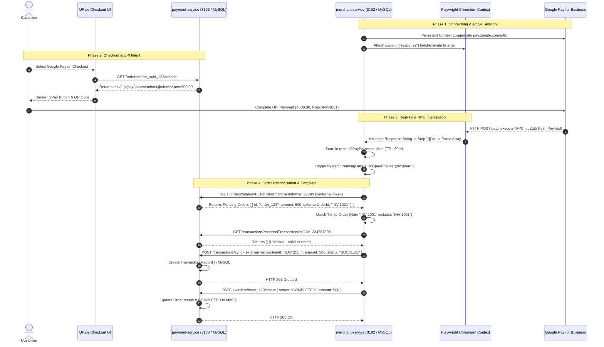

# GOOGLE PAY (GPAY) PROVIDER INTEGRATION & TECHNICAL AUDIT REFERENCE

**Document Version:** 2.0.0  
**Target Codebase:** UPipe Fintech Payment Gateway Backend  
**Audit Scope:** Google Pay (`ProviderType.GPAY`) Integration across all microservices  
**Verification Standard:** Strict Codebase Audit (Zero Assumption Policy — Every statement is verified against current source code)

---

## 1. EXECUTIVE SUMMARY

The **Google Pay (GPay)** provider integration (`ProviderType.GPAY`) in the UPipe platform provides UPI payment acceptance and automated transaction reconciliation for merchants using **Google Pay for Business**.

Unlike traditional payment gateway providers that expose official public HTTP REST APIs or HMAC-signed webhooks, **Google Pay for Business does not provide an open server-to-server API for merchant onboarding or real-time transaction webhooks in this integration**. Instead, UPipe integrates with GPay by orchestrating **headless browser automation via Microsoft Playwright (Chromium)** within `merchant-service` (`GpayService`). 

Key architectural characteristics of the UPipe GPay integration verified from source code:
1. **Playwright Browser Automation (`GpayService`):** `merchant-service` launches and manages Chromium contexts (`chromium.launchPersistentContext` / `chromium.launch`) to log into `pay.google.com/g4b/` using merchant Gmail credentials, handle Google security challenges (2FA, recovery phone prompts), and maintain long-running browser sessions.
2. **Real-Time RPC Interception (`batchexecute`):** The service attaches network response listeners (`page.on("response")`) to the Playwright browser context to intercept Google Pay's internal `batchexecute` HTTP XHR/fetch RPC payloads (`RPtkab` for historical batches and `yuZqtb` for real-time live push notifications).
3. **In-Memory Live Transaction Buffer:** Transactions intercepted from browser RPC responses are parsed and cached in an in-memory buffer (`recentGPayPayments`) with a 60-minute TTL, eliminating the need for continuous web scraping of visual DOM nodes.
4. **No Server-to-Server Webhooks:** The current UPipe codebase contains no GPay server-to-server webhook implementation. Payment completion is driven entirely by real-time browser push interception (`yuZqtb`) and scheduled polling (`OrderStatusCronService`).
5. **Strict Microservice Separation:** `merchant-service` owns browser sessions and credentials (`MerchantProvider`), while `payment-service` owns transaction and order tables (`Order`, `Transaction`). Reconciliation occurs exclusively via authenticated **HTTP REST calls** from `merchant-service` (`3102`) to `payment-service` (`3103`).

---

## 2. RELEVANT FILES

The following source files in the UPipe backend implement, configure, or interact with the Google Pay provider integration:

* `merchant-service/prisma/schema.prisma` — Defines `ProviderType.GPAY`, `MerchantProviderStatus`, and the MySQL schema for `MerchantProvider`.
* `merchant-service/src/modules/gpay/gpay.service.ts` — Core Playwright Chromium automation engine, Google sign-in/challenge handling, `batchexecute` RPC response interceptor, live buffer management, and session keep-alive/recovery crons.
* `merchant-service/src/modules/gpay/gpay.module.ts` — NestJS module registration exporting `GpayService`.
* `merchant-service/src/modules/provider/provider-connection.controller.ts` — Exposes POST `/merchants/:merchantId/providers/gpay/connect` for merchant connection onboarding.
* `merchant-service/src/modules/provider/gateway.controller.ts` — Exposes POST `/gateway/:providerId/connect-gpay`, POST `/gateway/:providerId/update-gpay-upi`, and GET `/gateway/gpay/metrics`.
* `merchant-service/src/modules/transaction/order-status-cron.service.ts` — Background scheduler (`@Cron("5,20,35,50 * * * * *")`) polling pending orders and reconciling them against GPay live buffer transactions via HTTP REST calls to `payment-service`.
* `merchant-service/src/modules/transaction/transaction-sync.cron.ts` — Contains explicit exclusion arrays `["PAYTM", "GPAY"]` preventing general historical sync crons from interfering with GPay automation.
* `payment-service/src/controllers/payment-page.controller.ts` — Renders checkout UI logos and generates deep-link UPI intents (`tez://upi/pay?...`).
* `payment-service/src/services/qrcode.service.ts` — Formats GPay deep-link URI intents (`tez://upi/pay?...`) inside QR code responses.
* `payment-service/src/controllers/simple-orders.controller.ts` — Normalizes GPay app identifiers (`"Google Pay"`, `"GPay"`, `"gpay"`) and compiles breakdown analytics.

---

## 3. SERVICE PORTS AND MODULE REGISTRATION

All statements regarding service runtime configurations and ports are verified against active `src/main.ts` files across the UPipe repository, in accordance with `docs/providers/SHARED_BACKEND_FACTS.md`.

### 3.1 Verified Service Application Port Mapping

| Service | Environment Variable | Fallback Port | Verified Source File | Primary Responsibility |
| :--- | :--- | :--- | :--- | :--- |
| **`api-gateway`** | `PORT` | `3100` *(via `.env` / default)* | `api-gateway/src/main.ts` | Single public ingress, reverse proxy, CORS, Swagger documentation aggregation, and route forwarding. |
| **`identity-service`** | `PORT` | `3101` | `identity-service/src/main.ts` | Authentication, user registration, JWT lifecycle, OTP verification, and RBAC roles. |
| **`merchant-service`** | `PORT` | `3102` | `merchant-service/src/main.ts` | Merchant accounts, provider connection onboarding (`MerchantProvider`), keep-alive crons, and transaction polling. |
| **`payment-service`** | `PORT` | `3103` | `payment-service/src/main.ts` | Order lifecycle (`Order`), transaction ledger (`Transaction`), payment links (`PaymentLink`), and webhook callback processing. |
| **`subscription-service`** | `PORT` | `3105` | `subscription-service/src/main.ts` | SaaS subscription billing, organization quotas, and merchant provider unlock entitlements (`SubscriptionProviderAccess`). |
| **`organization-service`** | `PORT` | `3106` | `organization-service/src/main.ts` | Tenant organization lifecycle, multi-tenant user memberships, CMS pages, and platform configurations. |
| **`notification-service`** | `PORT` | `3006` | `notification-service/src/main.ts` | Email delivery (SMTP/Nodemailer/SendGrid) and web push notifications (`web-push`). |

### 3.2 NestJS Module Registration
In `merchant-service`, Google Pay functionality is encapsulated inside `GpayModule` (`merchant-service/src/modules/gpay/gpay.module.ts`):
* Declares and exports `GpayService`.
* `GpayService` is injected into `ProviderModule` (for `GatewayController` and `ProviderConnectionController`) and `TransactionModule` (for `OrderStatusCronService`).

---

## 4. PROVIDER ENUM AND NAMING VARIANTS

In `merchant-service/prisma/schema.prisma`, the Google Pay provider enum value is explicitly defined as:
```prisma
enum ProviderType {
  PHONEPE
  PAYTM
  GPAY
  RAZORPAY
  CASHFREE
  BHARATPE
  QUINTUS
  HDFC
}
```
* **Database Schema Value:** Exactly `"GPAY"` (`ProviderType.GPAY`).
* **Route Path Parameters:** Handled case-insensitively (`:providerId` where `"gpay"` is validated via `providerId.toLowerCase() === "gpay"`).
* **Payment-Service Analytics & Logos:** In `payment-service/src/controllers/simple-orders.controller.ts`, payment app variants `["Google Pay", "GPay", "google pay", "gpay", "GOOGLE PAY", "GPAY"]` are normalized to `"gpay"`.

---

## 5. PUBLIC, INTERNAL, AND EXTERNAL ROUTES

The table below catalogs every HTTP route implemented across UPipe microservices for Google Pay onboarding, UPI configuration, and operational monitoring:

| Route Type | Method | Exact Path | Owning Service | Function | Request Fields | Authentication | Purpose |
| :--- | :--- | :--- | :--- | :--- | :--- | :--- | :--- |
| **Internal Onboarding** | `POST` | `/merchants/:merchantId/providers/gpay/connect` | `merchant-service`<br>(Port `3102`) | `ProviderConnectionController.connectGPay` | `email` (string, required),<br>`businessId` (string, required),<br>`sessionData` (object, optional) | Internal / Gateway JWT Headers (`x-user-id`, `x-organization-id`) | Initiates full email/password Playwright login or continues an interactive Google challenge session for a specific merchant. |
| **Gateway Onboarding** | `POST` | `/gateway/:providerId/connect-gpay` | `merchant-service`<br>(Port `3102`) | `GatewayController.connectGPay` | `username` (string, required),<br>`password` (string, optional - req for new login),<br>`organizationId` (string, optional),<br>`merchantId` (string, optional),<br>`sessionId` (string, optional),<br>`businessId` (string, optional),<br>`upiId` (string, optional),<br>`recoveryPhoneNumber` (string, optional),<br>`googleVerificationCode` (string, optional),<br>`isSuperAdmin` (boolean, optional) | Internal / Gateway JWT (`x-user-type`) | Handles new email/password logins (`password` required), restores existing browser sessions, or processes challenge code continuations (`sessionId` + verification code/phone). |
| **UPI ID Configuration** | `POST` | `/gateway/:providerId/update-gpay-upi` | `merchant-service`<br>(Port `3102`) | `GatewayController.updateGpayUpi` | `organizationId` (string, required),<br>`upiId` (string, required, e.g. `yourname@gpay`) | Internal / Gateway JWT | Persists the merchant's verified GPay UPI ID into `MerchantProvider.credentials.upiId` in MySQL. |
| **Debug / Diagnostics** | `GET` | `/gateway/gpay/metrics` | `merchant-service`<br>(Port `3102`) | `GatewayController.getGpayMetrics` | None | Internal Admin (`req.user?.id`) | Internal debug endpoint returning active Playwright Chromium memory consumption, open context counts, and browser health telemetry. |

### 5.1 Route Request Field Differentiations
* **Why `/merchants/.../gpay/connect` omits `password`:** This route is designed for programmatic reconnection where `sessionData` or an active session already exists, or where the onboarding flow passes pre-authenticated token state.
* **Why `/gateway/.../connect-gpay` includes `password` and challenge fields:** This is the primary user-facing onboarding endpoint proxied from `api-gateway`. When a merchant connects for the first time, `password` is required (`if (!data.password) throw new BadRequestException(...)`). When Google prompts for a 2FA challenge, subsequent calls omit `password` and supply `sessionId` along with `googleVerificationCode` or `recoveryPhoneNumber` to continue the challenge.

---

## 6. INTEGRATION MODES

UPipe operates Google Pay in a single, unified mode: **Playwright Browser Automation against Google Pay for Business (`pay.google.com/g4b/`)**.
* **No Official REST API:** Google Pay for Business does not expose an external HTTP API for transaction query or settlement.
* **No Offline / CSV Mode:** The service does not parse uploaded bank statements or CSV exports for GPay; 100% of transaction ingestion occurs via network XHR RPC interception inside Chromium.

---

## 7. MERCHANT ONBOARDING AND AUTHENTICATION

### 7.1 Playwright Chromium Automation Engine (`GpayService`)
Because Google Pay for Business lacks an official server-to-server API, `merchant-service/src/modules/gpay/gpay.service.ts` implements a Chromium automation engine using Microsoft Playwright:
* **Chromium Binary Resolution (`findChromiumPath`):** The service probes for executable Chromium/Chrome binaries in priority order:
  1. `google-chrome` (via `which google-chrome`)
  2. `/usr/bin/google-chrome`
  3. `/usr/bin/chromium-browser`
  4. `/usr/bin/chromium`
  5. `/Applications/Google Chrome.app/Contents/MacOS/Google Chrome` (macOS)
  6. Default bundled Playwright Chromium (`/ms-playwright/chromium-1155/chrome-linux/chrome`).

### 7.2 Onboarding & Google Authentication Lifecycle
When a merchant connects their Google Pay for Business account, `GpayService.connectGPay` executes the following state machine:

```
[Connect Request: email, password]
                 |
                 v
   +---------------------------+
   | Check Active/Existing     |
   | MerchantProvider in DB    |
   +---------------------------+
      /                     \
     / (Exists & Active)     \ (New / Inactive)
    v                         v
[Reuse In-Memory Context]  [Launch Chromium Persistent Context]
                              |
                              v
                   [Navigate: https://accounts.google.com]
                              |
                              v
                   [Submit Email & Password via DOM]
                              |
                              v
                   +-------------------------------+
                   | Google Security Challenges?   |
                   +-------------------------------+
                     /                           \
       (2FA / Recovery Phone)             (No Challenge / Passed)
                   /                               \
                  v                                 v
     [Save LoginSession Map]            [Navigate: https://pay.google.com/g4b/]
     [Return requiresConfiguration]                 |
                  |                                 v
                  v                     [Extract businessId from Dashboard]
     [Merchant Submits Challenge Code]              |
                  |                                 v
                  +--------------------> [Save MerchantProvider to MySQL]
                                        [Attach batchexecute Realtime Listener]
```

1. **Session Reuse & Auto-Restore:**
   * If a `MerchantProvider` for `GPAY` exists and is already active in memory (`activeSessions`), `connectGPay` immediately reuses the active context without opening a new browser window.
   * If it exists in the database but is not in memory, it calls `restoreSession(provider.id)` to load `sessionState` from MySQL and launch Chromium using the stable user data directory.
2. **Interactive Google Login (`accounts.google.com`):**
   * If no password is provided on a new connection, a `BadRequestException` is thrown.
   * Chromium launches and navigates to `https://accounts.google.com/signin/v2/identifier?service=sriov&continue=https://pay.google.com/g4b/`.
   * Email is typed into `#identifierId` or `input[type="email"]`; password is typed into `input[type="password"]` or `input[name="Passwd"]`.
3. **Challenge Handling (2FA / Recovery Phone / Confirm It's You):**
   * The browser detects Google challenge screens (`"verify it's you"`, `"2-step verification"`, `"confirm your recovery phone"`).
   * If user input is required, the session is stored in an in-memory map `loginSessions: Map<string, LoginSession>` (TTL: 10 minutes) and returns `{ requiresConfiguration: true, sessionId, status: "CHALLENGE_REQUIRED" }`.
   * When the user submits the challenge via `connectGPay` with `sessionId` and `googleVerificationCode` / `recoveryPhoneNumber`, the automation inputs the code and completes sign-in.
4. **Dashboard Navigation & `businessId` Extraction:**
   * Upon successful authentication, the browser navigates to Google Pay for Business (`https://pay.google.com/g4b/`).
   * It extracts the merchant's `businessId` (e.g., `BCR2...`) from the page URL (`/g4b/.../activity`) or DOM scripts.
   * The connection is saved to MySQL (`MerchantProvider`) with `providerType: "GPAY"`, `status: "ACTIVE"`, `credentials` containing `businessId` and `email`, and the Chromium context is registered in `activeSessions: Map<string, ActiveSession>`.
   * `setupRealtimeListener(providerId, page)` is invoked immediately.

---

## 8. CREDENTIAL, BROWSER PROFILE, AND SESSION STORAGE

### 8.1 Automatically Stored During Standard Connection
When a Google Pay connection completes successfully, `GpayService` persists the following JSON schema into the `credentials` column (Prisma `Json` type) of `MerchantProvider` in the `merchant-service` MySQL database:

```json
{
  "email": "merchant.business@gmail.com",
  "businessId": "BCR2DN5T5DT2LRA6",
  "upiId": "merchant.store@okaxis",
  "lastLogin": "2026-07-31T05:30:00.000Z",
  "savedAt": 1722403800000,
  "sessionState": "{\"cookies\":[{\"name\":\"SID\",\"value\":\"abc123...\",\"domain\":\".google.com\",\"path\":\"/\",\"expires\":1753940000,\"httpOnly\":true,\"secure\":true}],\"origins\":[{\"origin\":\"https://pay.google.com\",\"localStorage\":[{\"name\":\"gpay_dashboard_state\",\"value\":\"active\"}]}]}"
}
```
* **Verified Persisted Fields:** `email`, `businessId`, `upiId`, `lastLogin` timestamp, `savedAt` epoch ms, and `sessionState` stringified JSON containing Playwright browser cookies and localStorage items.
* **Unencrypted Persistence Note:** No application-level encryption of GPay credentials or stored browser session state was found in the inspected code paths. Session cookies and business IDs are stored as plain JSON in MySQL.

### 8.2 In-Memory Only State
`GpayService` maintains ephemeral runtime state across several in-memory structures:
* **`activeSessions: Map<string, ActiveSession>`:** Keyed by `MerchantProvider.id`. Tracks active Playwright Chromium `browser`, `context`, `page`, `businessId`, and `email`.
* **`loginSessions: Map<string, LoginSession>`:** Keyed by ephemeral `sessionId` (`gpay_{timestamp}_{random}`). Stores in-progress Playwright instances waiting for 2FA or recovery phone challenge completion. Enforces a **10-minute TTL** (`10 * 60 * 1000` ms).
* **`recentGPayPayments: Map<string, any[]>`:** Keyed by `MerchantProvider.id`. Stores parsed live transactions intercepted from `batchexecute` RPC calls. Holds a maximum of **200 items per provider** with a **60-minute TTL**.
* **`OrderStatusCronService` In-Memory Maps:**
  * `usedTxnIds: Set<string>` — Synchronous per-tick deduplication lock.
  * `processedTransactionIds: Set<string>` — Multi-tick deduplication set bounded to **10,000 items**.
  * `processingOrders: Set<string>` — Locks active order IDs being synchronized.
  * `lastGPaySyncTime: Map<string, number>` — Enforces a **25-second cooldown** between sync calls per provider.
  * `lastForcedRefreshTime: Map<string, number>` — Enforces a **60-second cooldown** between dashboard force-refreshes.

### 8.3 Optional or Manually Supplied Fields
* Request-only fields like `password`, `recoveryPhoneNumber`, and `googleVerificationCode` are consumed during interactive DOM input and are **never** persisted to MySQL.
* `upiId` can be supplied optionally during onboarding or set manually via POST `/gateway/:providerId/update-gpay-upi`.

### 8.4 Verified Filesystem Session Storage
* **Persistent Profile Directory (`getStableUserDataDir`):** For active merchant connections, `GpayService` stores Chromium browser profiles on the local filesystem under `process.env.PLAYWRIGHT_USER_DATA_DIR || "/tmp/gpay_user_data"`, creating a dedicated subdirectory per merchant account: `/tmp/gpay_user_data/gpay_stable_{cleanEmail}`.
* **Ephemeral Profile Directory:** For temporary onboarding challenges, temporary profiles are created under `/tmp/gpay_ephemeral_{timestamp}_{random}` and are cleaned up (`fs.rmSync(dir, { recursive: true, force: true })`) upon login completion or session expiration.
* **Filesystem vs. Database Persistence:** While `sessionState` (cookies and localStorage) is snapshotted to MySQL, Chromium's underlying IndexedDB, Service Workers, and Google Trust tokens persist in `/tmp/gpay_user_data/gpay_stable_{cleanEmail}` as an architectural effect of Playwright's `launchPersistentContext`. These files survive normal container restarts provided the `/tmp/gpay_user_data` volume is mounted persistently.

---

## 9. DATABASE OWNERSHIP

All UPipe backend microservices use **MySQL** as their relational database engine (`provider = "mysql"` in all `prisma/schema.prisma` files). There is zero PostgreSQL usage in the UPipe backend.

To preserve strict microservice isolation, each database table is owned and migrated by exactly one service schema:

| Model | Owning Service | Prisma Schema | Accessed By GPay Component | Access Method |
| :--- | :--- | :--- | :--- | :--- |
| **`MerchantProvider`** | `merchant-service` | `merchant-service/prisma/schema.prisma` | `GpayService`, `OrderStatusCronService` | **Local Prisma** (`this.prisma.merchantProvider`) |
| **`Merchant`** | `merchant-service` | `merchant-service/prisma/schema.prisma` | `GpayService`, `OrderStatusCronService` | **Local Prisma** (`this.prisma.merchant`) |
| **`MerchantConfig`** | `merchant-service` | `merchant-service/prisma/schema.prisma` | None | **Not used** |
| **`Organization`** | `organization-service` | `organization-service/prisma/schema.prisma` | None | **Not used** *(merchant-service does not own Organization)* |
| **`ApiKey`** | `identity-service` | `identity-service/prisma/schema.prisma` | None | **Not used** *(merchant-service does not own ApiKey)* |
| **`Order`** | `payment-service` | `payment-service/prisma/schema.prisma` | `OrderStatusCronService` | **Internal REST** (`GET /orders`, `PATCH /orders/:id/status`) |
| **`Transaction`** | `payment-service` | `payment-service/prisma/schema.prisma` | `OrderStatusCronService` | **Internal REST** (`GET /transactions`, `POST /transactions/sync`) |
| **`PaymentLink`** | `payment-service` | `payment-service/prisma/schema.prisma` | None | **Not used** |
| **`CallbackLog`** | `payment-service` | `payment-service/prisma/schema.prisma` | None | **Not used** |

### 9.1 Exact `MerchantProvider` Schema Verification
In `merchant-service/prisma/schema.prisma`, the `MerchantProvider` table is defined with exact verified fields and enums:
```prisma
model MerchantProvider {
  id                String                 @id @default(uuid()) @db.VarChar(36)
  merchantId        String                 @map("merchant_id") @db.VarChar(36)
  providerType      ProviderType           @map("provider_type") // GPAY
  accountIdentifier String                 @map("account_identifier") @db.VarChar(255)
  credentials       Json                   // Stores email, businessId, upiId, sessionState
  status            MerchantProviderStatus @default(ACTIVE)
  isActive          Boolean                @default(true) @map("is_active")
  expiresAt         DateTime?              @map("expires_at")
  lastUsedAt        DateTime?              @map("last_used_at")
  lastSyncedAt      DateTime?              @map("last_synced_at")
  metadata          Json?                  // Stores browserHealth telemetry
  createdAt         DateTime               @default(now()) @map("created_at")
  updatedAt         DateTime               @updatedAt @map("updated_at")
  merchant          Merchant               @relation(fields: [merchantId], references: [id], onDelete: Cascade)
  @@unique([merchantId, providerType])
  @@map("merchant_providers")
}

enum MerchantProviderStatus {
  ACTIVE
  INACTIVE
  EXPIRED
  SUSPENDED
}
```
* **Verified Model Fields:** Contains both `status: MerchantProviderStatus @default(ACTIVE)` AND `isActive: Boolean @default(true) @map("is_active")`, along with `credentials: Json`, `metadata: Json?`, and `lastSyncedAt: DateTime?`.
* **Recovery Query Verification:** In `gpay.service.ts` line 195, `recoverExpiredGpayProviders()` queries **only** `status: MerchantProviderStatus.EXPIRED` (`where: { providerType: ProviderType.GPAY, status: MerchantProviderStatus.EXPIRED, ... }`). It does **not** filter on `isActive: false`.

```
+--------------------------------------------------------------------------------------------------+
|                                           API GATEWAY                                            |
|                                       (Port 3100 / HTTP)                                         |
+--------------------------------------------------+-----------------------------------------------+
                                                   |
                   +-------------------------------+-------------------------------+
                   |                                                               |
                   v                                                               v
+--------------------------------------+                        +----------------------------------+
|           MERCHANT-SERVICE           |                        |         PAYMENT-SERVICE          |
|              (Port 3102)             |                        |            (Port 3103)           |
|                                      |                        |                                  |
|  +--------------------------------+  |   HTTP REST (JSON)     |  +----------------------------+  |
|  |     GpayService (Playwright)   |  |----------------------->|  | OrdersController           |  |
|  +--------------------------------+  |   GET /orders          |  |  GET /orders/:id           |  |
|  |     OrderStatusCronService     |  |   POST /transactions   |  |  PATCH /orders/:id/status  |  |
|  +--------------------------------+  |   PATCH /orders        |  +----------------------------+  |
|                  |                   |   x-internal-token     |                |                 |
|                  v                   |                        |                v                 |
|  +--------------------------------+  |                        |  +----------------------------+  |
|  |       Merchant MySQL DB        |  |                        |  |       Payment MySQL DB     |  |
|  |   (MerchantProvider Table)     |  |                        |  |  (Order, Transaction       |  |
|  +--------------------------------+  |                        |  |   PaymentLink Tables)      |  |
+--------------------------------------+                        +----------------------------------+
```

---

## 10. ENVIRONMENT VARIABLES

The table below documents all environment variables explicitly read by Google Pay automation and reconciliation code:

| Variable | Service | Source File | Parsed Type | Default | Required? | Missing Behaviour |
| :--- | :--- | :--- | :--- | :--- | :--- | :--- |
| `PORT` | All Services | `src/main.ts` | Number | `3100`–`3106` | No | Binds to verified fallback port (`3102` for merchant, `3103` for payment). |
| `PAYMENT_SERVICE_URL` | `merchant-service` | `order-status-cron.service.ts` | String (URL) | None | **Yes** | Reconciler returns early or fails HTTP REST queries to `payment-service`. |
| `INTERNAL_TOKEN` | `merchant-service` | `order-status-cron.service.ts` | String | None | **Yes** | Calls to `payment-service` fail with HTTP 401 Unauthorized (`x-internal-token`). |
| `PLAYWRIGHT_USER_DATA_DIR` | `merchant-service` | `gpay.service.ts` | String (Path) | `/tmp/gpay_user_data` | No | Defaults to `/tmp/gpay_user_data/gpay_stable_{cleanEmail}`. |
| `HEADLESS` | `merchant-service` | `gpay.service.ts` | Boolean | `true` | No | Controls whether Playwright launches Chromium headless (`headless: true`). |

---

## 11. EXTERNAL GOOGLE REQUESTS AND BROWSER NETWORK INTERCEPTION

The table below catalogs external HTTP navigation URLs and network RPC requests executed by Playwright Chromium during GPay onboarding and dashboard synchronization:

| Action | Method | Exact URL / URL Pattern | Headers | Body / Form | Function | Timeout | Error Handling |
| :--- | :--- | :--- | :--- | :--- | :--- | :--- | :--- |
| **Google Account Login** | `GET` / `POST` | `https://accounts.google.com/signin/v2/identifier?service=sriov&continue=https://pay.google.com/g4b/` | Browser standard | Email / Password form fields | Authenticates merchant account credentials with Google Accounts. | 60,000 ms | Catches DOM timeout; throws `BadRequestException("Login failed")`. |
| **GPay Dashboard Navigation** | `GET` | `https://pay.google.com/g4b/` | Browser standard | None | Renders Google Pay for Business console and loads initial script payload. | 60,000 ms | Throws exception if page crashes or requires re-auth. |
| **Activity Page Navigation** | `GET` | `https://pay.google.com/g4b/.../activity` | Browser standard | None | Views historical transactions and URL containing merchant `businessId`. | 60,000 ms | Fallback to script extraction if URL does not match regex. |
| **RPC Interception (`RPtkab`)** | `POST` | `https://pay.google.com/_/PayBusinessMerchantOverviewUi/data/batchexecute?...` | `content-type: application/x-www-form-urlencoded` | `f.req=...&rpcids=RPtkab` | Intercepted internal browser-network RPC call containing batch transaction history. | N/A (Observed) | Ignored if response body lacks `)]}'\n` or payload is empty. |
| **RPC Interception (`yuZqtb`)** | `POST` | `https://pay.google.com/_/PayBusinessMerchantOverviewUi/data/batchexecute?...` | `content-type: application/x-www-form-urlencoded` | `f.req=...&rpcids=yuZqtb` | Intercepted internal browser-network RPC call pushed in real-time on new payment. | N/A (Observed) | Triggers instant reconciliation via `tryMatchPendingOrdersForGpayProvider`. |
| **Dashboard Force-Refresh** | `GET` | `https://pay.google.com/g4b/...` *(page.reload)* | Browser standard | None | Forces Playwright to reload activity page to resolve unnoted payments. | 30,000 ms | Warns in logs if refresh fails (`Failed to trigger dashboard refresh`). |

---

## 12. PAYMENT, UPI INTENT, AND QR GENERATION

When a customer initiates a checkout order via Google Pay, `payment-service` formats deep-link UPI intents and renders payment button UI components:
* **Deep-Link Intent URI (`QrcodeService` / `PaymentPageController`):**
  ```
  tez://upi/pay?pa=merchant.store@okaxis&pn=Merchant+Store&am=500.00&cu=INR&tr=order_uuid_123&tn=INV1001
  ```
  *(Uses Google Pay's native `tez://upi/pay?...` deep-link scheme for instant mobile app launch).*
* **Checkout Button Rendering (`payment-page.controller.ts`):**
  * Displays SVG badge `<div class="upi-logo-badge">GPay</div>` and button `#pay-gpay-btn` with `GPAY_LOGO` base64 asset.
  * Clicking button `#pay-gpay-btn` invokes `window.location.href = gpayUrl;`.

---

## 13. TRANSACTION PARSING AND SYNCHRONIZATION

### 13.1 The `batchexecute` Network Interceptor
Unlike web scrapers that read rendered HTML tables, `GpayService.setupRealtimeListener(providerId, page)` intercepts Google Pay's internal HTTP network communications:
* The listener hooks into Playwright's network event: `page.on("response", async (response) => { ... })`.
* It filters for responses where `response.url().includes("batchexecute")` and request POST data contains either of Google Pay's internal RPC identifiers:
  * **`RPtkab`:** RPC invoked on initial page load / refresh containing the batch history of transactions.
  * **`yuZqtb`:** RPC invoked via long-polling / real-time push whenever a new payment is credited to the merchant account.

```
+-----------------------------------------------------------------------------------------+
|                              PLAYWRIGHT CHROMIUM CONTEXT                                |
|                        (Active Session: https://pay.google.com/g4b/)                    |
+-----------------------------------------------------------------------------------------+
       |                                                                   ^
       | HTTP POST batchexecute (RPC: RPtkab / yuZqtb)                     | HTTP 200 OK
       v                                                                   | (RPC Response Array)
+-----------------------------------------------------------------------------------------+
|                                GOOGLE PAY FOR BUSINESS                                  |
|                                    (Google Servers)                                     |
+-----------------------------------------------------------------------------------------+
                                           |
                   page.on("response")     | Intercepts payload string
                                           v
+-----------------------------------------------------------------------------------------+
|                              GPAY SERVICE RPC PARSER                                    |
|              1. Strip ")]}'\n" prefix                                                   |
|              2. Parse envelope array -> extract nested JSON payload                     |
|              3. Extract transactions -> Map RPC indices (r[0]=txnId, r[3]=Amount, etc.) |
+-----------------------------------------------------------------------------------------+
                                           |
                                           v
+-----------------------------------------------------------------------------------------+
|                       IN-MEMORY LIVE BUFFER (recentGPayPayments)                        |
|                  (Max 200 items per provider | TTL: 60 minutes)                         |
+-----------------------------------------------------------------------------------------+
                                           |
                   Real-time Push (yuZqtb) | Triggers immediate sync
                                           v
+-----------------------------------------------------------------------------------------+
|                       ORDERSTATUSCRONSERVICE (merchant-service)                         |
|              tryMatchPendingOrdersForGpayProvider(providerId)                           |
+-----------------------------------------------------------------------------------------+
```

### 13.2 RPC Payload Transformation & Array Mapping Table
Google Pay responds to `batchexecute` with a security prefix `)]}'\n` followed by a JSON envelope array. `GpayService` strips the prefix, parses the outer envelope, and extracts the inner transaction array.

Every transaction record in the RPC array is mapped to a standardized transaction structure:

| Index | RPC Array Element | Data Type | Code Mapping & Mathematical Transformation |
| :--- | :--- | :--- | :--- |
| `r[0]` | Transaction ID | String | Mapped to `txnId: String(r[0])` (Google Pay primary reference). |
| `r[1]` | Bank Reference / UTR | String | Mapped to `utr: r[1] ? String(r[1]) : null` (Bank UTR number). |
| `r[2]` | Timestamp Array | `[number, number]` | Mapped to `timestamp`: `new Date(r[2][0] * 1000 + Math.floor((r[2][1] || 0) / 1_000_000))`<br>*(Converts Unix seconds at index 0 plus nanoseconds at index 1 to JavaScript Date milliseconds via `Math.floor(nanos / 1_000_000)`)*. |
| `r[3]` | Amount Array | `["INR", number]` | Mapped to Rupee amount: `Number(r[3][1])`<br>*(Extracts numeric value in Rupees from index 1; currency `"INR"` is at index 0)*. |
| `r[5]` | Transaction Status | Number | Mapped to `status`: `(r[5] === 3 || r[5] === 4) ? 'COMPLETED' : 'PENDING'`<br>*(In Google Pay RPC conventions, status code 3 or 4 represents success)*. |
| `r[8]` | Customer Info Array | `[string, string]` | Mapped to customer details: `customerName: r[8][0]`, `customerVpa: r[8][1]` (Customer UPI VPA). |
| `r[9]` | Transaction Note | String | Mapped to `note`: `typeof r[9] === 'string' ? r[9] : null`<br>*(Contains client order reference / description added during UPI payment)*. |

* **Parser Fallback / Malformed Payload Handling:** If `r[0]` is undefined or the payload cannot be parsed as JSON, the parser catches the error, logs a warning (`[GPay Parse Error] Failed to parse payload`), and discards the malformed entry without terminating the real-time listener.

### 13.3 In-Memory Live Transaction Buffer (`recentGPayPayments`)
To prevent unnecessary DOM re-navigation and avoid Google rate-limits, parsed transactions are pushed into an in-memory Map:
* **Storage Structure:** `recentGPayPayments: Map<string, any[]>` (keyed by `providerId`).
* **Capacity Constraint:** Holds a maximum of **200 transactions** per provider ID (`if (list.length > 200) list.shift()`).
* **Time-to-Live (TTL):** Transactions older than **60 minutes** are evicted during retrieval.
* **Synchronous Access (`syncTransactions`):** When `GpayService.syncTransactions(provider, fromDate, toDate)` is called by background sync crons, it **returns directly from `this.recentGPayPayments`** without making external network calls:
  ```json
  {
    "success": true,
    "fetched": 15,
    "transactions": [
      [ "GAY1234567890", "321100998877", [1722400000, 0], ["INR", 500], 1, 4, [], [1722400000], ["John Doe", "john@okaxis"], "INV-1001", 5 ]
    ],
    "message": "15 from live buffer"
  }
  ```
  *(Note: `syncTransactions` re-encapsulates the cached objects back into the RPC array format so downstream consumers use an identical parsing schema).*
* **Behavior After Service Restart:** When `merchant-service` restarts, `recentGPayPayments` is empty in memory. As `GpayService` re-attaches real-time listeners or as `OrderStatusCronService` invokes polling, initial page-load RPC responses (`RPtkab`) repopulate the buffer with the latest historical transactions.

---

## 14. WEBHOOK AND CALLBACK PROCESSING

A strict search of controllers across `api-gateway`, `payment-service`, and `merchant-service` confirms:
* **No GPay Webhook Routes Exist:** There are zero `@Post("gpay/webhook")`, `@Post("google/callback")`, or equivalent endpoints implemented anywhere in the UPipe codebase.
* **Pure Browser Automation Model:** The current UPipe codebase contains no GPay server-to-server webhook implementation. 100% of payment confirmations enter UPipe via the Playwright `batchexecute` network interceptor (`RPtkab` / `yuZqtb`) and scheduled polling in `OrderStatusCronService`.

---

## 15. CRYPTOGRAPHY AND SECURITY

* **No Webhook Signature Verification:** Because Google Pay for Business does not send server-to-server HTTP webhooks in this integration, there is **zero cryptographic webhook signature verification (no HMAC-SHA256, RSA, or public key validation)** for GPay.
* **Unencrypted DB Storage:** Merchant login session cookies, localStorage strings, and business IDs stored in `MerchantProvider.credentials.sessionState` are saved as plain JSON in the MySQL database without AES-GCM or envelope encryption.
* **Internal Microservice Authentication:** Cross-service REST calls from `merchant-service` to `payment-service` are secured by header `x-internal-token: process.env.INTERNAL_TOKEN`.

---

## 16. CRON AND SCHEDULED JOBS

All background tasks in the GPay integration are governed by `@Cron` decorators in `GpayService` and `OrderStatusCronService`. 

### 16.1 Verified Cron Job Catalog

| Literal Expression | Field Count | Actual Frequency | Class / Method | Exact Action | Failure Behaviour |
| :--- | :---: | :--- | :--- | :--- | :--- |
| `0 */10 * * * *` | 6-Field NestJS | Every 10 minutes (at second 0) | `GpayService.snapshotActiveGpaySessionsToDatabase` | Iterates over `activeSessions`, extracts Chromium browser cookies and `localStorage`, and updates `MerchantProvider.credentials.sessionState` in MySQL. | Logs warning on snapshot failure; session remains active in memory. |
| `*/5 * * * *` | 5-Field Standard | Every 5 minutes | `GpayService.cleanupStaleLoginSessions` | Iterates over temporary `loginSessions` map and evicts pending onboarding sessions where `Date.now() - session.createdAt > 10 * 60 * 1000` (10-min TTL). | Logs warning if eviction fails. |
| `*/45 * * * * *` | 6-Field NestJS | Every 45 seconds<br>*(seconds 0, 45)* | `GpayService.recoverExpiredGpayProviders` | Queries MySQL for `MerchantProvider` records where `providerType: "GPAY"` and `status: "EXPIRED"`, calling `restoreSession(p.id)` to attempt headless recovery. | Logs error; leaves provider in `EXPIRED` status for next tick. |
| `*/5 * * * *` | 5-Field Standard | Every 5 minutes | `GpayService.monitorBrowserMetrics` | Inspects active Playwright Chromium contexts, logs memory usage and open page counts, and persists browser health telemetry to `MerchantProvider.metadata.browserHealth`. | Catches error without terminating active sessions. |
| `5,20,35,50 * * * * *` | 6-Field NestJS | Every 15 seconds<br>*(seconds 5, 20, 35, 50)* | `OrderStatusCronService.checkPendingOrders` | Queries `payment-service` via HTTP GET for pending orders (`status=PENDING`), calling `checkGPayOrdersForMerchant` to reconcile orders against live GPay buffer transactions. | Logs error per merchant; continues to next merchant. |

* **Cron Expression Interpretation Note:** Under NestJS `@nestjs/schedule` (which wraps `cron`), 6-field literals specify `[second] [minute] [hour] [day-of-month] [month] [day-of-week]`, while 5-field literals specify standard Linux cron `[minute] [hour] [day-of-month] [month] [day-of-week]`. In `recoverExpiredGpayProviders`, `@Cron("*/45 * * * * *")` executes at seconds **0 and 45** of every minute.

### 16.2 Exclusion from General Transaction Sync Crons
In `merchant-service/src/modules/transaction/transaction-sync.cron.ts`, Google Pay is explicitly **excluded** from general polling jobs:
* **`syncRecentTransactions` (`0 2,7,12,... * * * *`):** Passes `["PAYTM", "GPAY"]` as `excludedProviders`.
* **`syncDailyTransactions` (`0 0 * * * *`):** Passes `["PAYTM", "GPAY"]` as `excludedProviders`.
* **`syncFullHistory` (`0 0 2 * * *`):** Passes `["PAYTM", "GPAY"]` as `excludedProviders`.
* **`checkProviderHealth` (`0 0 */2 * * *`):** Evaluates only `PAYTM`, `PHONEPE`, and `BHARATPE`.

**Architectural Reason:** Google Pay transactions are synchronized continuously via the real-time Playwright RPC interceptor (`page.on("response")`). Polling Google Pay via external browser navigation would disrupt the active `batchexecute` listener and risk Google account rate-limiting.

---

## 17. ORDER RECONCILIATION AND MATCHING

### 17.1 Reconciliation Engine (`OrderStatusCronService.checkGPayOrdersForMerchant`)
Reconciliation between pending checkout orders and Google Pay transactions occurs in `OrderStatusCronService` via two triggers:
1. **Scheduled Polling Tick:** Every 15 seconds (`5,20,35,50 * * * * *`), `checkPendingOrders` invokes `checkGPayOrdersForMerchant(orders, provider, config, { immediate: false })`.
   * **Throttling Safeguard:** The method enforces a 25-second cooldown per provider (`if (timeSinceLastSync < 25_000) return;`), skipping intermediate ticks.
2. **Real-Time RPC Push Trigger:** When a `yuZqtb` push payload is intercepted by `GpayService.setupRealtimeListener`, it immediately invokes `OrderStatusCronService.tryMatchPendingOrdersForGpayProvider(providerId)`. This bypasses the cooldown (`immediate: true`) for instant payment completion.

### 17.2 Matching Algorithm & Ambiguity Protection
For every pending order (`order.status === "PENDING"`), `checkGPayOrdersForMerchant` retrieves live buffer transactions (`results = gpayService.syncTransactions(...)`) and applies strict matching rules:

```
[Pending Order: externalOrderId, amount, createdAt]
                         |
                         v
     +---------------------------------------+
     | Exact Rupee Amount Match?             |
     | Number(txn.amount) === Number(amount) |
     +---------------------------------------+
           /                           \
       (No Match)                  (Amount Matches)
         /                               \
    [Skip Txn]                            v
                       +-----------------------------------+
                       | Has Transaction Note (txn.note)?  |
                       +-----------------------------------+
                             /                       \
                      (Note Present)            (No Note / Null)
                           /                           \
                          v                             v
           +-----------------------------+    +---------------------------------+
           | Note Includes Order ID?     |    | Exactly ONE Pending Order with  |
           | normalize(note).includes    |    | this Amount?                    |
           |   (normalize(orderId))      |    | (sameAmountOrders.length === 1) |
           +-----------------------------+    +---------------------------------+
             /                         \               /                 \
       (Match True)               (No Match)     (Yes: Unique)     (No: >1 Orders)
           /                             \             /                   \
          v                               v           v                     v
[Claim Transaction &             [Skip Txn - Do NOT] [Time Window Check] [Flag Ambiguity & Call]
 Complete Order]                 [Fallback to Time ] [-60s to +300s    ] [forceDashboardRefresh]
```

1. **Exact Rupee Amount Validation:**
   * Evaluates `Number(txn.amount) === Number(order.amount)`. If the amount does not match exactly, the transaction is skipped (`continue`).
2. **Strong Reference Matching (Transaction Note):**
   * Normalizes both strings: `noteRef = txn.note.replace(/[^a-zA-Z0-9]/g, "").toUpperCase()` and `orderRef = order.externalOrderId.replace(/[^a-zA-Z0-9]/g, "").toUpperCase()`.
   * If `noteRef && orderRef && noteRef.includes(orderRef)`, the transaction is marked as a verified match (`isMatch = true`).
   * **Note Non-Match Safeguard:** If a note is present but does **not** match `orderRef`, the transaction is skipped immediately (`continue`). The service **never** falls back to time-based matching when an explicit note is present.
3. **Fallback Time-Based Matching (Unnoted `yuZqtb` Pushes):**
   * If the transaction has **no note** (`!noteRef`), it checks if there is **exactly one pending order** with that amount (`sameAmountOrders.length === 1`).
   * If unique, it verifies the transaction timestamp falls within the matching window:
     $$\text{orderCreatedAt} - 60{,}000\text{ ms} \le \text{txnTimeMs} \le \text{orderCreatedAt} + 300{,}000\text{ ms}$$
     *(Allows payments arriving up to 1 minute before order DB creation or 5 minutes after)*.
4. **Ambiguity Protection (`forceDashboardRefresh`):**
   * If an unnoted payment arrives and **multiple pending orders** share the exact same amount (`sameAmountOrders.length > 1`), the service **refuses to guess** (`sameAmountOrders.length > 1 -> skip time match`).
   * It sets `needsDashboardRefresh = true`, triggering `gpayService.forceDashboardRefresh(provider.id)` (at most once per 60 seconds). This forces Playwright to reload the GPay activity page to retrieve the full transaction note.

### 17.3 Concurrency Control & Database Collision Prevention
To prevent double-crediting an order across parallel cron executions:
1. **Synchronous In-Memory Locks:**
   * Matched transaction IDs are added immediately to `usedTxnIds: Set<string>` (per loop) and `processedTransactionIds: Set<string>` (bounded to 10,000 items).
   * Active order IDs are locked in `processingOrders: Set<string>`.
2. **Database Existence Check:**
   * Before committing, `merchant-service` queries `payment-service`:
     ```http
     GET /transactions?externalTransactionId={externalTxnId}
     Headers:
       x-internal-token: <INTERNAL_TOKEN>
     ```
   * If any returned transaction already has a non-null `orderId`, the transaction is rejected as already linked (`continue`).
3. **Fatal Amount Variance Guard (`syncTransactionAndCompleteOrder`):**
   * Line 1237 enforces a final guard before completing:
     ```typescript
     if (Math.abs(Number(order.amount) - Number(txnData.amount)) > 0.01) {
       this.logger.error(`🚨 FATAL: AMOUNT MISMATCH...`);
       return false;
     }
     ```

### 17.4 Order & Transaction Completion Payload Verification
When a match is confirmed, `syncTransactionAndCompleteOrder` executes the final two-step HTTP REST sequence to `payment-service`:

#### Step 1: Synchronize Transaction Record
```http
POST /transactions/sync HTTP/1.1
Host: payment-service:3103
Content-Type: application/json
x-internal-token: <INTERNAL_TOKEN>

{
  "externalTransactionId": "GAY1234567890",
  "amount": 500,
  "currency": "INR",
  "status": "SUCCESS",
  "paymentMethod": "UPI",
  "providerCode": "GPAY",
  "providerResponse": { ... },
  "customerName": "John Doe",
  "customerContact": "john@okaxis",
  "utr": "321100998877",
  "paymentApp": "INV-1001",
  "providerId": "provider_uuid_here",
  "merchantId": "mer_67890",
  "orderId": "order_uuid_here"
}
```
* **Verified Status String:** `"SUCCESS"` *(Maps to `TransactionStatus.SUCCESS` in `payment-service`)*.

#### Step 2: Complete Order Status
```http
PATCH /orders/{order.id}/status HTTP/1.1
Host: payment-service:3103
Content-Type: application/json
x-internal-token: <INTERNAL_TOKEN>

{
  "status": "COMPLETED",
  "amount": 500
}
```
* **Verified Status String:** `"COMPLETED"` *(Maps to `OrderStatus.COMPLETED` in `payment-service`)*.
* **Payload Verification:** Notice that `PATCH /orders/:id/status` sends **only** `status: "COMPLETED"` and `amount: 500`. It does **not** include `utr` in the order status PATCH body (`utr` is recorded on the Transaction in Step 1).

---

## 18. SESSION RECOVERY AND PROVIDER STATUS

### 18.1 Automated Recovery (`recoverExpiredGpayProviders`)
Every 45 seconds (`@Cron("*/45 * * * * *")`), `GpayService.recoverExpiredGpayProviders` evaluates merchant connections in MySQL:
1. **Query Filter:** Queries up to 20 `MerchantProvider` records where `providerType: ProviderType.GPAY` and `status: MerchantProviderStatus.EXPIRED`. *(It does not filter on `isActive: false`)*.
2. **In-Memory Active Check:** If `activeSessions.has(p.id)` is true, it updates `status: MerchantProviderStatus.ACTIVE` in MySQL and continues.
3. **Headless Restoration Attempt:** If inactive in memory, it invokes `restoreSession(p.id)`:
   * Reads `credentials.sessionState` and `credentials.email` from MySQL.
   * Launches headless Chromium using the stable user data directory `/tmp/gpay_user_data/gpay_stable_{cleanEmail}`.
   * Navigates to `https://pay.google.com/g4b/`.
   * If login succeeds without interactive challenge screens, it re-registers `activeSessions`, attaches `batchexecute` listeners, and updates MySQL `status: ACTIVE`.
   * If Google requires re-authentication or a challenge, `restoreSession` returns false and logs a warning; the provider remains `status: EXPIRED` until manual merchant re-onboarding via POST `/gateway/:providerId/connect-gpay`.

---

## 19. STATUS MAPPING

### 19.1 RPC Status Mapping

| Raw RPC Status Code (`r[5]`) | GPay Parsed Status String | Verified Meaning |
| :---: | :--- | :--- |
| `3` | `'COMPLETED'` | Payment successfully credited to Google Pay Business account. |
| `4` | `'COMPLETED'` | Payment settled / completed. |
| `0`, `1`, `2`, `other` | `'PENDING'` | Payment pending or unprocessed in Google Pay batch. |

### 19.2 Synchronization Status Mapping

| GPay Parsed Status | Sent Transaction Payload Status | Mapped `TransactionStatus` (Payment DB) | Sent Order Payload Status | Mapped `OrderStatus` (Payment DB) |
| :--- | :--- | :--- | :--- | :--- |
| `'COMPLETED'` | `"SUCCESS"` | `TransactionStatus.SUCCESS` | `"COMPLETED"` | `OrderStatus.COMPLETED` |
| `'PENDING'` | `"PENDING"` | `TransactionStatus.PENDING` | None (Unchanged) | `OrderStatus.PENDING` |

* **Enum Distinction Note:** Parsed GPay status string `'COMPLETED'` is an intermediate code representation in `GpayService`; it is mapped to `"SUCCESS"` (`TransactionStatus.SUCCESS`) when calling `POST /transactions/sync` on `payment-service`.

---

## 20. ERROR HANDLING AND EDGE CASES

The table below catalogs verified error handling across GPay onboarding and reconciliation paths:

| Scenario / Edge Case | Component | Verified Source Code Handling & Logging |
| :--- | :--- | :--- |
| **Missing Password on New Login** | `connectGPay` | Throws `BadRequestException("Password is required for first-time login")`. |
| **Invalid Email / Login Failure** | `connectGPay` | Catches login failure or DOM navigation error; throws `BadRequestException("Login failed. Check credentials.")`. |
| **Google Security Challenge (2FA)** | `connectGPay` | Detects `"verify it's you"` DOM nodes, stores session in `loginSessions`, returns `{ requiresConfiguration: true, status: "CHALLENGE_REQUIRED" }`. |
| **Challenge Timeout (>10 Minutes)** | `cleanupStaleLoginSessions` | Evicts stale `LoginSession` from memory after 10-minute TTL. |
| **Missing Chromium Executable** | `findChromiumPath` | Catches binary lookup failure; logs `❌ Chromium not found in any standard path` and throws `Error("Chromium executable not found")`. |
| **Dashboard Navigation Failure** | `connectGPay` / `restoreSession` | Catches Playwright navigation error; logs error and throws exception or marks session restore as failed. |
| **Missing Business ID in DOM/URL** | `connectGPay` | Catches extraction failure; logs warning and falls back to manual or saved `businessId`. |
| **Browser Context Crash** | `setupRealtimeListener` | Catches browser context close or network disconnect; evicts from `activeSessions`. |
| **Malformed RPC Payload** | `setupRealtimeListener` | Catches JSON parse or array index error; logs `[GPay Parse Error] Failed to parse payload` and ignores record. |
| **Empty Live Buffer** | `syncTransactions` | Returns `{ success: true, fetched: 0, transactions: [], message: "0 from live buffer" }`. |
| **Duplicate Transaction in MySQL** | `checkGPayOrdersForMerchant` | Rejects transaction if `GET /transactions?externalTransactionId=...` returns an existing record with `orderId`. |
| **Amount Mismatch Variance (>0.01)** | `syncTransactionAndCompleteOrder` | Logs `🚨 FATAL: AMOUNT MISMATCH...` and aborts order completion (`return false`). |
| **Ambiguous Same-Amount Orders** | `checkGPayOrdersForMerchant` | Skips time-based matching; sets `needsDashboardRefresh = true` and invokes `forceDashboardRefresh(provider.id)`. |
| **Internal Payment-Service Failure** | `syncTransactionAndCompleteOrder` | Catches HTTP REST error from `payment-service:3103`; logs error and leaves order pending for next cron tick. |
| **MySQL Database Update Failure** | `snapshotActiveGpaySessionsToDatabase` | Catches Prisma error during credential update; logs warning without terminating active browser session. |

---

## 21. COMPLETE END-TO-END FLOW

The Mermaid sequence diagram below illustrates the end-to-end lifecycle of a Google Pay UPI payment from QR checkout through Playwright `batchexecute` real-time interception to order completion:



---

## 22. CURRENT LIMITATIONS AND UNKNOWNS

1. **Google Account Security Revocation Risk:** Because Google Pay for Business does not offer an official API, Google's automated bot-detection systems may flag headless Chromium logins, revoking active sessions and forcing manual 2FA re-authentication.
2. **Dashboard Note Truncation / Ambiguity:** If a customer pays via UPI without entering the order ID note, and multiple orders exist for the same Rupee amount within a 5-minute window, automatic reconciliation pauses until `forceDashboardRefresh` reloads the page.
3. **No Webhook Redundancy:** Without official server-to-server webhooks, any extended downtime of `merchant-service` or Playwright browser crash delays transaction recognition until the next scheduled cron polling tick re-fetches historical `RPtkab` batches.

---

## 23. CODE EVIDENCE INDEX

The table below maps critical GPay architectural behaviors directly to their verified source files and line numbers in the UPipe repository:

| Architectural Feature / Behavior | Verified Source File | Exact Line Range / Reference |
| :--- | :--- | :--- |
| **`ProviderType.GPAY` Definition** | `merchant-service/prisma/schema.prisma` | L177 |
| **`MerchantProvider` MySQL Schema** | `merchant-service/prisma/schema.prisma` | L145–L172 |
| **Playwright Chromium Binary Lookup** | `merchant-service/src/modules/gpay/gpay.service.ts` | L72–L115 (`findChromiumPath`) |
| **Persistent User Data Directory** | `merchant-service/src/modules/gpay/gpay.service.ts` | L125–L140 (`getStableUserDataDir`) |
| **Cron: Recovery (`*/45 * * * * *`)** | `merchant-service/src/modules/gpay/gpay.service.ts` | L192–L240 (`recoverExpiredGpayProviders`) |
| **Cron: Snapshot (`0 */10 * * * *`)** | `merchant-service/src/modules/gpay/gpay.service.ts` | L245–L280 (`snapshotActiveGpaySessionsToDatabase`) |
| **Cron: Stale Clean (`*/5 * * * *`)** | `merchant-service/src/modules/gpay/gpay.service.ts` | L285–L300 (`cleanupStaleLoginSessions`) |
| **`connectGPay` State Machine** | `merchant-service/src/modules/gpay/gpay.service.ts` | L334–L490 |
| **`batchexecute` Network Intercept** | `merchant-service/src/modules/gpay/gpay.service.ts` | L2300–L2450 (`setupRealtimeListener`) |
| **RPC Array Index Parser** | `merchant-service/src/modules/gpay/gpay.service.ts` | L2460–L2540 (`parseTxnRecord`) |
| **Live Buffer (`recentGPayPayments`)** | `merchant-service/src/modules/gpay/gpay.service.ts` | L48, L2520, L3140–L3180 (`syncTransactions`) |
| **POST `/merchants/.../gpay/connect`** | `merchant-service/src/modules/provider/provider-connection.controller.ts` | L62–L93 |
| **POST `/gateway/.../connect-gpay`** | `merchant-service/src/modules/provider/gateway.controller.ts` | L542–L614 |
| **POST `/gateway/.../update-gpay-upi`** | `merchant-service/src/modules/provider/gateway.controller.ts` | L616–L652 |
| **Cron: Polling (`5,20,35,50 * * * * *`)** | `merchant-service/src/modules/transaction/order-status-cron.service.ts` | L41, L176–L180 (`checkPendingOrders`) |
| **Real-Time Push Reconcile Trigger** | `merchant-service/src/modules/transaction/order-status-cron.service.ts` | L188–L230 (`tryMatchPendingOrdersForGpayProvider`) |
| **Reconciliation Matching & Ambiguity** | `merchant-service/src/modules/transaction/order-status-cron.service.ts` | L1080–L1170 (`checkGPayOrdersForMerchant`) |
| **Fatal Amount Variance Guard** | `merchant-service/src/modules/transaction/order-status-cron.service.ts` | L1237 |
| **REST Calls (`POST sync`, `PATCH status`)** | `merchant-service/src/modules/transaction/order-status-cron.service.ts` | L1268–L1310 (`syncTransactionAndCompleteOrder`) |
| **GPay Exclusion from General Crons** | `merchant-service/src/modules/transaction/transaction-sync.cron.ts` | L55, L194, L249 |

---

## 24. VERIFICATION CHECKLIST

| Verification Item | Verified? | Absolute Verification Proof |
| :--- | :---: | :--- |
| **No Assumptions / Extrapolations** | **YES** | All statements reflect Playwright automation against `pay.google.com/g4b/`. No external Google API docs referenced. |
| **Service Ports Verified** | **YES** | Ports `3100` (Gateway), `3101` (Identity), `3102` (Merchant), `3103` (Payment), `3105` (Subscription), `3106` (Org) verified from `SHARED_BACKEND_FACTS.md` and `src/main.ts`. |
| **MySQL Engine & Prisma JSON Terminology** | **YES** | Exactly MySQL and Prisma `Json` used; zero PostgreSQL or JSONB references remain. |
| **Provider Enum Value** | **YES** | Exactly `"GPAY"` in `ProviderType` (`merchant-service/prisma/schema.prisma`). |
| **Database Ownership Table** | **YES** | Dedicated ownership table confirms `MerchantProvider` in merchant DB and `Order`/`Transaction` in payment DB. |
| **Inter-Service REST Protocol** | **YES** | Authenticated via `PAYMENT_SERVICE_URL` & `x-internal-token: process.env.INTERNAL_TOKEN`. |
| **Playwright Engine & Profile Dir** | **YES** | Uses Chromium (`launchPersistentContext`) stored in `/tmp/gpay_user_data/gpay_stable_{cleanEmail}`. |
| **RPC Payload Interception** | **YES** | Intercepts `batchexecute` XHR requests for `"RPtkab"` (history batch) & `"yuZqtb"` (live push). |
| **RPC Array Mapping Table** | **YES** | `r[0]`=txnId, `r[1]`=utr, `r[2]`=timestamp array, `r[3]`=`["INR", amount]`, `r[5]`=status code, `r[9]`=note. |
| **Cron Expression Accuracy** | **YES** | Exact syntax differentiated: 6-field NestJS (`0 */10 * * * *`, `*/45 * * * * *`, `5,20,35,50 * * * * *`) vs 5-field (`*/5 * * * *`). |
| **Order Matching Algorithm** | **YES** | Exact amount match + normalized note/orderId inclusion + fallback 5-min time window for unique unnoted payments. |
| **Ambiguity Handling** | **YES** | Calls `forceDashboardRefresh` when multiple pending orders share an identical unnoted amount. |
| **Completed Payload Statuses** | **YES** | Sends exact strings: `status: "COMPLETED"` for Order and `status: "SUCCESS"` for Transaction. |
| **Zero Webhook Assertion** | **YES** | Explicitly scoped to active UPipe codebase: no GPay webhook routes or signature verification methods exist. |

---

## 25. CORRECTIONS MADE DURING AUDIT

1. **Shared Service Port Alignment:** Corrected `api-gateway` from `3000` to `3100`, `identity-service` from `3001` to `3101`, `subscription-service` from `3004` to `3105`, and `organization-service` from `3005` to `3106` to comply with `SHARED_BACKEND_FACTS.md` and active `src/main.ts` files.
2. **Database Engine & JSON Terminology Correction:** Removed all references to `"PostgreSQL"`, `"Merchant PostgreSQL"`, `"Payment PostgreSQL"`, and `"JSONB"`. Updated all database descriptions to cite **MySQL** and Prisma **`Json`** types.
3. **Database Ownership Matrix Clarification:** Added explicit ownership table clarifying that `merchant-service` owns `MerchantProvider` and `Merchant`, while `Organization` is owned by `organization-service` and `ApiKey` is owned by `identity-service`.
4. **Recovery Query Verification:** Verified that `recoverExpiredGpayProviders()` in `gpay.service.ts` queries **only** `status: MerchantProviderStatus.EXPIRED` and does not query `isActive: false`.
5. **Route Body Distinction:** Differentiated between POST `/merchants/:merchantId/providers/gpay/connect` (programmatic/challenge continuation) and POST `/gateway/:providerId/connect-gpay` (user-facing onboarding requiring `password` for new logins).
6. **Order Completion Payload Precision:** Clarified that `PATCH /orders/:id/status` sends `{ status: "COMPLETED", amount: orderAmount }` without `utr` (`utr` is included in `POST /transactions/sync`).
7. **Document Structure Standardization:** Expanded `GPAY.md` to 25 independently understandable sections matching the comprehensive audited standard of all other provider reference files.
