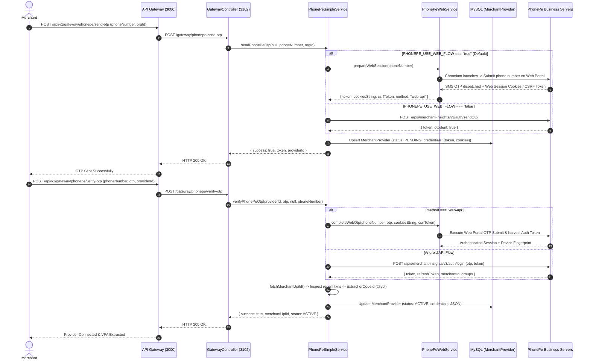
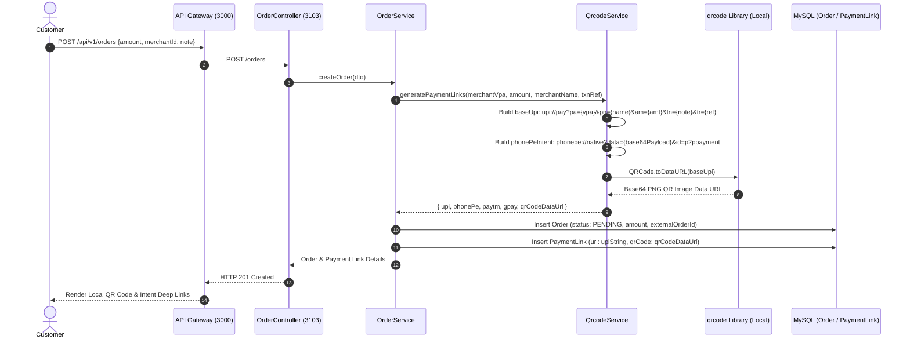
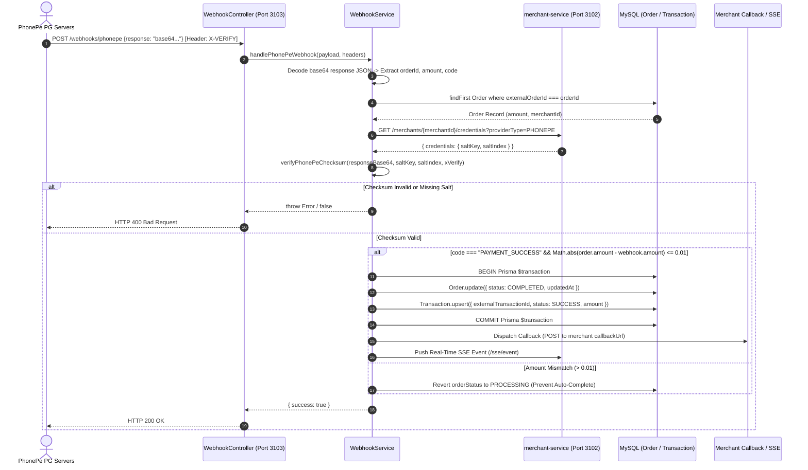
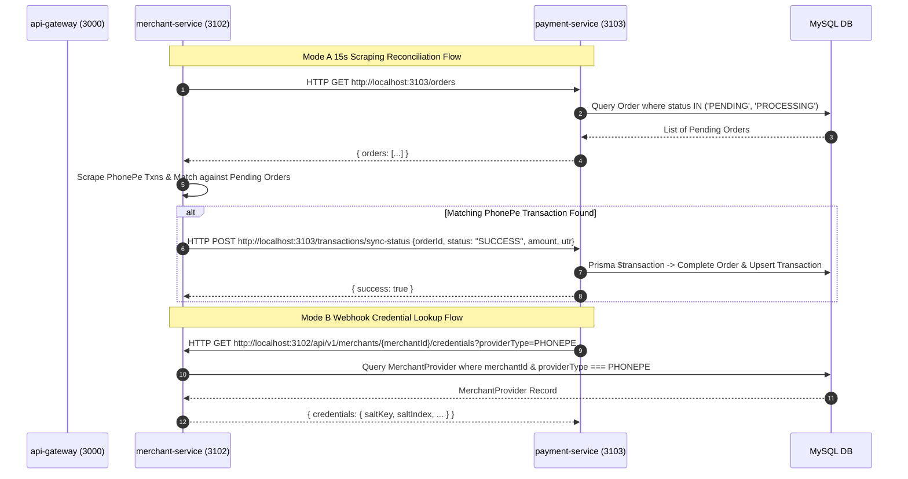

# PHONEPE Integration Reference

> **Official Engineering Technical Documentation — UPipe Fintech Payment Gateway**  
> **Target Audience:** Enterprise Solution Architects, Lead Developers, Software Engineers, DevOps & Security Auditors.  
> **Source of Truth:** Strict Code-Verification Audit of the UPipe Backend Source Code (`upipe_backend`).

---

## 1. Overview & Architecture

The **PhonePe** integration in UPipe is a dual-mode payment gateway and merchant automation subsystem. Unlike conventional payment gateways that rely exclusively on a standard merchant API, UPipe implements two distinct integration methodologies for PhonePe:

1. **Mode A: PhonePe Business / Merchant Insights (Web-API & Android API Flow)**  
   - Implemented in `merchant-service`.
   - Designed for automated merchant account connection without requiring official PhonePe PG API onboarding.
   - Utilizes mobile OTP authentication (`/apis/merchant-insights/v3/auth/sendOtp`), browser automation (Puppeteer/Playwright headless Chromium via `PhonePeWebService`), and PhonePe Android Business APIs (`PhonePeSimpleService`) to extract the merchant's Virtual Payment Address (VPA) and scrape real-time transaction history for order reconciliation.
2. **Mode B: PhonePe PG / Hermes SDK Flow**  
   - Implemented in `payment-service`.
   - Designed for merchants onboarded onto the official PhonePe Payment Gateway (Hermes/PG v1 API).
   - Utilizes cryptographic checksum verification (`SHA-256` hash concatenation), direct status polling (`/apis/hermes/pg/v1/status/{merchantId}/{txnId}`), and webhook callback processing (`POST /webhooks/phonepe`).

> [!IMPORTANT]
> **No Explicit Integration-Mode Selection Mechanism:**  
> `No explicit integration-mode selection mechanism was found in the current codebase.`  
> The database schema (`MerchantProvider`) stores `providerType: PHONEPE` without a database column distinguishing between "Mode A" and "Mode B". In runtime execution, `merchant-service` routes all `/gateway/phonepe/*` onboarding calls through Mode A (Merchant Insights), whereas `payment-service` executes Mode B (PG Hermes) checksum logic when handling webhooks or PG status checks if `credentials.saltKey` (or `credentials.key`) is present. Credentials from one mode are not automatically available to or compatible with the other mode.

```
                  +-------------------------------------------------------------+
                  |                      CLIENT / BROWSER                       |
                  +-------------------------------------------------------------+
                     |                                                       ^
                     | HTTP POST /api/v1/gateway/phonepe/send-otp            |
                     | HTTP POST /api/v1/orders                              |
                     v                                                       |
        +-------------------------+                                          |
        |       API Gateway       |                                          |
        |     (Port: 3000)        |                                          |
        +-------------------------+                                          |
          /                     \                                            |
         /                       \                                           |
Proxy   /                         \ Proxy                                    |
       v                           v                                         |
+--------------------------+    +--------------------------+                 |
|     merchant-service     |    |     payment-service      |                 |
|       (Port: 3102)       |    |       (Port: 3103)       |                 |
|                          |    |                          |                 |
|  - PhonePeSimpleService  |    |  - QrcodeService         |                 |
|  - PhonePeWebService     |    |  - WebhookService        |                 |
|  - OrderStatusCronService|    |  - CronService (Hermes)  |                 |
+--------------------------+    +--------------------------+                 |
       |             |                        |                              |
       |             |                        |                              |
       v             v                        v                              |
+-------------+ +------------------+   +-------------------------------+     |
| MySQL DB    | | PhonePe Business |   | PhonePe PG Hermes API         |     |
| (merchants) | | Merchant Insights|   | (/apis/hermes/pg/v1/status)   |     |
+-------------+ +------------------+   +-------------------------------+     |
```

---

## 2. Relevant Files

| File Path | Class or Function Name | Responsibility | Called By | Calls or Dependencies |
| :--- | :--- | :--- | :--- | :--- |
| `merchant-service/src/modules/provider/phonepe-simple.service.ts` | `PhonePeSimpleService` | Manages Mode A PhonePe Business OTP login, session validation, VPA extraction (`fetchMerchantUpiId`), and transaction history fetching. | `GatewayController`, `ProviderConnectionController`, `OrderStatusCronService` | PhonePe `/apis/merchant-insights/v3/*` endpoints, `phonepeChecksum.ts`, Prisma (`MerchantProvider`) |
| `merchant-service/src/modules/provider/phonepe-web.service.ts` | `PhonePeWebService` | Controls headless Chromium automation (Puppeteer/Playwright) to bypass `APP_UPDATE_AND_RELOGIN_REQUIRED` errors and scrape cookies/tokens. | `PhonePeSimpleService`, `PhonePeKeepaliveCron`, `OrderStatusCronService` | Headless Chromium, Local filesystem profiles (`PHONEPE_PERSISTENT_PROFILE_ROOT`) |
| `merchant-service/src/modules/provider/phonepe-keepalive.cron.ts` | `PhonePeKeepaliveCron` | Background cron executing every 2 minutes to keep Mode A session cookies active and refresh tokens before expiry. | NestJS Scheduler (`@Cron`) | `PhonePeWebService`, Prisma (`MerchantProvider`) |
| `merchant-service/src/modules/transaction/order-status-cron.service.ts` | `OrderStatusCronService` | Near-real-time reconciliation engine; polls `PENDING`/`PROCESSING` orders every 15 seconds and matches against PhonePe transactions. | NestJS Scheduler (`@Cron`) | `PhonePeSimpleService`, `PhonePeWebService`, REST call to `payment-service` (`GET /orders`, `POST /transactions/sync-status`) |
| `merchant-service/src/modules/provider/gateway.controller.ts` | `GatewayController` | Exposes client-facing onboarding routes (`/gateway/phonepe/send-otp`, `complete-otp`, `verify-otp`, `select-group`, `save-connection`). | API Gateway (`/api/v1/gateway/*`) | `PhonePeSimpleService` |
| `merchant-service/src/modules/provider/provider-connection.controller.ts` | `ProviderConnectionController` | Exposes merchant-scoped onboarding routes (`/merchants/:merchantId/providers/phonepe/send-otp`, `verify-otp`). | API Gateway (`/api/v1/merchants/:merchantId/providers/*`) | `PhonePeSimpleService` |
| `payment-service/src/services/qrcode.service.ts` | `QrcodeService` | Generates UPI payment URIs (`upi://pay`), custom PhonePe intent deep links (`phonepe://native`), and renders QR code PNG data URLs locally. | `OrderService.createOrder` | NPM library `qrcode` |
| `payment-service/src/services/webhook.service.ts` | `WebhookService` | Verifies Mode B PhonePe PG `X-VERIFY` signatures, enforces amount tolerance, and atomically updates Order and Transaction records. | `WebhookController.handlePhonePeWebhook` | Prisma (`Order`, `Transaction`, `CallbackLog`), `verifyPhonePeChecksum` |
| `payment-service/src/controllers/webhook.controller.ts` | `WebhookController` | Exposes direct external webhook callback endpoint (`POST /webhooks/phonepe`). | PhonePe PG Servers, API Gateway | `WebhookService` |
| `payment-service/src/services/cron.service.ts` | `CronService` | Background cron polling PhonePe Hermes `/pg/v1/status` every 5 minutes for stale pending orders and running daily ledger reconciliation. | NestJS Scheduler (`@Cron`) | PhonePe PG API (`/apis/hermes/pg/v1/status`), `generateChecksum`, Prisma |
| `payment-service/src/utils/phonepeChecksum.ts` | `generateChecksum`, `verifyPhonePeChecksum` | Implements cryptographic SHA-256 hash concatenation (`sha256(payload + endpoint + salt) + "###" + index`) for Mode B PG signature verification. | `WebhookService`, `CronService` | Node.js `crypto` module (`sha256`) |

---

## 3. Module Registration & Service Ports

### Service Ports (Reference: [`SHARED_BACKEND_FACTS.md`](file:///upipe_backend/docs/providers/SHARED_BACKEND_FACTS.md))
Each UPipe microservice binds to `process.env.PORT` with an explicit fallback port verified from its respective `src/main.ts` file:

| Service Name | Source File | Verified Fallback Port (`main.ts`) | Documented in `README.md` | Primary Responsibility in PhonePe Integration |
| :--- | :--- | :--- | :--- | :--- |
| **`api-gateway`** | `api-gateway/src/main.ts` (Line 59) | `3100` (`process.env.PORT`, L59) | Port `3100` | Reverse proxy; strips `/api/v1` and routes requests to downstream microservices. |
| **`merchant-service`** | `merchant-service/src/main.ts` (Line 43) | `3102` (`process.env.PORT \|\| 3102`, L43) | Port `3102` | Manages Mode A PhonePe onboarding, OTP login, browser automation, and 15s transaction scraping. |
| **`payment-service`** | `payment-service/src/main.ts` (Line 32) | `3103` (`process.env.PORT \|\| 3103`, L32) | Port `3103` | Manages Order/Transaction schemas, QR code generation, Mode B webhooks, and Hermes PG polling. |
| **`subscription-service`** | `subscription-service/src/main.ts` (Line 32) | `3105` (`process.env.PORT \|\| 3105`, L32) | Port `3105` | Manages subscription plan entitlement records (references `'PHONEPE'` as an entitled provider code). |
| **`identity-service`** | `identity-service/src/main.ts` (Line 53) | `3101` (`process.env.PORT \|\| 3101`, L53) | Port `3101` | Authenticates merchant/user JWT tokens before API Gateway proxying. |
| **`organization-service`** | `organization-service/src/main.ts` (Line 56) | `3106` (`process.env.PORT \|\| 3106`, L56) | Port `3106` | Manages organization hierarchy and multi-tenant scoping. |
| **`notification-service`** | `notification-service/src/main.ts` (Line 24) | `3006` (`process.env.PORT \|\| 3006`, L24) | Port `3006` | Dispatches SMS, email, and SSE push alerts for transaction events. |

### Verified Public and Internal Routes

```
                                  +------------------------------------+
                                  |     API GATEWAY (Port: 3100)       |
                                  |     Prefix: /api/v1                |
                                  +------------------------------------+
                                    /               |                \
         +-------------------------+                |                 +-------------------------+
         | /gateway/*                               | /orders/*                                 | /webhooks/*
         | /merchants/:id/providers/*               |                                           |
         v                                          v                                           v
+------------------------------------+    +------------------------------------+     +------------------------------------+
|          MERCHANT-SERVICE          |    |          PAYMENT-SERVICE           |     |          PAYMENT-SERVICE           |
|            (Port: 3102)            |    |            (Port: 3103)            |     |            (Port: 3103)            |
+------------------------------------+    +------------------------------------+     +------------------------------------+
| POST /gateway/phonepe/send-otp     |    | POST /orders                       |     | POST /webhooks/phonepe             |
| POST /gateway/phonepe/complete-otp |    | GET  /orders/:id/status            |     | (Gateway: /api/v1/webhooks/phonepe)|
| POST /gateway/phonepe/verify-otp   |    |                                    |     +------------------------------------+
| POST /gateway/phonepe/select-group |    +------------------------------------+
| POST /gateway/phonepe/save-conn    |                      ^
|                                    |                      |
| POST /merchants/:id/providers/     |                      |
|      phonepe/send-otp              |                      |
| POST /merchants/:id/providers/     |                      |
|      phonepe/verify-otp            |                      |
|                                    |                      |
| [Internal REST Endpoints]          |                      |
| GET  /merchants/:id/credentials    |                      |
| POST /transactions/sync-status     |======================+
+------------------------------------+  Internal HTTP (Axios)
```

1. **Client-Facing Gateway Routes (Proxied by `api-gateway` on Port 3000):**
   - `POST /api/v1/gateway/phonepe/send-otp` $\rightarrow$ Proxied to `merchant-service` (`POST /gateway/phonepe/send-otp`).
   - `POST /api/v1/gateway/phonepe/complete-otp` $\rightarrow$ Proxied to `merchant-service` (`POST /gateway/phonepe/complete-otp`).
   - `POST /api/v1/gateway/phonepe/verify-otp` $\rightarrow$ Proxied to `merchant-service` (`POST /gateway/phonepe/verify-otp`).
   - `POST /api/v1/gateway/phonepe/select-group` $\rightarrow$ Proxied to `merchant-service` (`POST /gateway/phonepe/select-group`).
   - `POST /api/v1/gateway/phonepe/save-connection` $\rightarrow$ Proxied to `merchant-service` (`POST /gateway/phonepe/save-connection`).
   - `POST /api/v1/merchants/:merchantId/providers/phonepe/send-otp` $\rightarrow$ Proxied to `merchant-service` (`POST /merchants/:merchantId/providers/phonepe/send-otp`).
   - `POST /api/v1/merchants/:merchantId/providers/phonepe/verify-otp` $\rightarrow$ Proxied to `merchant-service` (`POST /merchants/:merchantId/providers/phonepe/verify-otp`).
   - `POST /api/v1/orders` $\rightarrow$ Proxied to `payment-service` (`POST /orders`).
2. **Direct External Callback Route (Reachable directly or via Gateway):**
   - `POST /webhooks/phonepe` $\rightarrow$ Handled by `WebhookController` in `payment-service` (Port 3103).
   - Also proxyable via Gateway at `POST /api/v1/webhooks/phonepe`.
3. **Internal Microservice REST Routes:**
   - `GET /merchants/:id/credentials?providerType=PHONEPE` $\rightarrow$ Handled by `MerchantController` in `merchant-service` (Port 3102); invoked by `payment-service` to retrieve merchant credentials.
   - `POST /transactions/sync-status` $\rightarrow$ Handled by `TransactionController` in `payment-service` (Port 3103); invoked by `OrderStatusCronService` in `merchant-service` to complete reconciled orders.

---

## 4. PhonePe Integration Modes (Mode A vs. Mode B)

```
                    +-------------------------------------------------+
                    |               MERCHANT ONBOARDING               |
                    +-------------------------------------------------+
                                             |
                   Is Merchant using Mode A (Business / Insights)
                   or Mode B (Official Hermes PG SDK / API)?
                                             |
               +-----------------------------+-----------------------------+
               |                                                           |
               v                                                           v
+------------------------------------+                   +------------------------------------+
|  MODE A: Merchant Insights / Web   |                   |     MODE B: Hermes PG SDK / API    |
|   (merchant-service - Port 3102)   |                   |    (payment-service - Port 3103)   |
+------------------------------------+                   +------------------------------------+
| * OTP Mobile Login                 |                   | * Official Merchant ID             |
| * Headless Chromium Automation     |                   | * Salt Key & Salt Index            |
| * Session Cookies & CSRF Tokens    |                   | * Cryptographic SHA-256 Checksum   |
| * VPA / QR Handle Extraction (@ybl)|                   | * Webhook Callback (/webhooks/...) |
| * 15-Second Scraping Reconciliation|                   | * PG Status Polling (/pg/v1/status)|
+------------------------------------+                   +------------------------------------+
```

### Mode A: PhonePe Business / Merchant Insights
- **Purpose:** Onboards merchants who do not have an official PhonePe PG merchant API contract by connecting their standard PhonePe Business application account.
- **Components:** `PhonePeSimpleService`, `PhonePeWebService`, `PhonePeKeepaliveCron`, `OrderStatusCronService`.
- **Verified Capabilities:**
  - **OTP Authentication:** Requests and validates 5-digit/6-digit SMS OTPs via `/apis/merchant-insights/v3/auth/sendOtp` and `/auth/login`.
  - **Browser Automation:** Uses automated Puppeteer/Playwright Chromium instances (`PhonePeWebService`) to simulate browser logins, harvest `token`, `refreshToken`, `deviceFingerprint`, `cookiesString`, and `csrfToken`, and circumvent PhonePe's mobile app enforcement (`APP_UPDATE_AND_RELOGIN_REQUIRED`).
  - **VPA Extraction:** Automatically parses transaction history to retrieve the merchant's UPI QR ID (`results[0].merchantDetails.qrCodeId`) and appends `@ybl` if an `@` handle is missing (`PhonePeSimpleService.fetchMerchantUpiId`, Lines 1206–1233).
  - **Session Keep-Alive:** Executes background cron jobs every 2 minutes (`PhonePeKeepaliveCron`) to poll PhonePe servers and prevent cookie expiration.
  - **Transaction Scraping & Reconciliation:** Scrapes merchant transaction history every 15 seconds (`OrderStatusCronService`) and matches incoming UPI payments against pending orders.
  - **Webhook Absence:** `Mode A (Merchant Insights) has no webhook support.` It relies 100% on active background polling and transaction scraping.

### Mode B: PhonePe PG / Hermes
- **Purpose:** Integrates enterprise merchants who possess an official PhonePe Hermes Payment Gateway contract.
- **Components:** `WebhookService`, `WebhookController`, `CronService`, `phonepeChecksum.ts`.
- **Verified Capabilities:**
  - **Credential Configuration:** Requires an official `merchantId`, `saltKey` (or `key`), and `saltIndex` stored in `MerchantProvider.credentials`.
  - **Cryptographic Signature Verification:** Enforces signature validation on all webhooks via `X-VERIFY` header calculation (`verifyPhonePeChecksum`).
  - **PG Status Polling:** Queries the official PhonePe Hermes API endpoint (`GET https://api.phonepe.com/apis/hermes/pg/v1/status/{merchantId}/{txnId}`) every 5 minutes for orders older than 15 minutes (`CronService.checkPhonePeStatus`).
  - **Webhook Processing:** Directly receives asynchronous HTTP POST callbacks from PhonePe PG servers at `POST /webhooks/phonepe`.

---

## 5. Environment Variables

The following table documents all **12 verified environment variables** starting with `PHONEPE_` found in the UPipe backend source code (`merchant-service`):

| Environment Variable | Service | Default Value | Optional? | Purpose | Verified Source File Reference |
| :--- | :--- | :--- | :--- | :--- | :--- |
| **`PHONEPE_CHECKSUM_ENDPOINT`** | `merchant-service` | `""` (Empty string) | Yes | External proxy endpoint (`http://localhost:4000/checksum?trd=`) used to generate Android SDK `x-request-sdk-checksum` headers. If missing, requests proceed without the header. | `phonepe-simple.service.ts` (Lines 36, 65) |
| **`PHONEPE_USE_WEB_FLOW`** | `merchant-service` | `"true"` | Yes | Controls whether onboarding defaults to Puppeteer/Playwright web browser automation (`"true"`) or direct HTTP Android API calls (`"false"`). | `phonepe-simple.service.ts` (Line 259) |
| **`PHONEPE_WEB_FORCE_HTTP`** | `merchant-service` | `"false"` (or `"true"`) | Yes | When `"true"`, bypasses Chromium automation during session keepalive/recovery and executes pure HTTP Axios requests. | `phonepe-keepalive.cron.ts` (Line 99), `phonepe-web.service.ts` (Lines 131, 1189) |
| **`PHONEPE_WEB_SESSION_EXPIRED_LIMIT`** | `merchant-service` | `3` | Yes | Threshold of consecutive session expiration errors before marking a provider as `EXPIRED`. Defaults to `3`. | `phonepe-keepalive.cron.ts` (Line 155), `order-status-cron.service.ts` (Line 487) |
| **`PHONEPE_PERSISTENT_BROWSER`** | `merchant-service` | `"false"` | Yes | Enables persistent Chromium user-data directory profiles across browser launches. | `phonepe-web.service.ts` (Lines 1303, 4086) |
| **`PHONEPE_PERSISTENT_PROFILE_ROOT`** | `merchant-service` | `<tmp>/phonepe-profiles`| Yes | Root directory path on disk where persistent Chromium profile directories are stored. | `phonepe-web.service.ts` (Line 58) |
| **`PHONEPE_WEB_EPHEMERAL_BEFORE_AXIOS`**| `merchant-service` | `"false"` | Yes | When `"true"`, launches a temporary ephemeral Chromium browser to harvest fresh cookies before running Axios scraping. | `phonepe-web.service.ts` (Line 4141) |
| **`PHONEPE_WEB_AXIOS_RECENT_PREFLIGHT`**| `merchant-service` | `""` / `"false"` | Yes | Experimental toggle to execute a lightweight Axios preflight request before initiating browser automation. | `phonepe-web.service.ts` (Line 4397) |
| **`PHONEPE_ENABLE_LEGACY_WARMER`** | `merchant-service` | `"false"` | Yes | Enables legacy background session warming for connected PhonePe accounts. | `phonepe-simple.service.ts` (Line 1280) |
| **`PHONEPE_WEB_BULK_INGEST_AFTER_RECENT`**| `merchant-service` | `""` | Yes | Optional flag to trigger bulk transaction ingestion immediately after recent transaction sync completes. | `phonepe-web.service.ts` (Line 4422) |
| **`PHONEPE_WEB_ANALYTICS_USER_ID`** | `merchant-service` | `""` | Yes | Optional override user ID header attached to telemetry/analytics requests during web scraping. | `phonepe-web.service.ts` (Line 4425) |
| **`PHONEPE_WEB_ANALYTICS_MERCHANT_USER_ID`**| `merchant-service` | `""` | Yes | Optional override merchant user ID header attached to telemetry/analytics requests during web scraping. | `phonepe-web.service.ts` (Line 4427) |

> [!NOTE]
> **Removed / Unsupported Variables:**  
> The variables `PHONEPE_APP_VERSION` and `PHONEPE_CLIENT_ID` are **not** present in environment configuration. In `phonepe-simple.service.ts`, `appVersion: 1795` is a hardcoded literal constant, and merchant IDs are retrieved dynamically from database records.

---

## 6. PhonePe Onboarding Flow (Mode A)

The onboarding flow connects a merchant's PhonePe Business account in `merchant-service` without requiring official PG credentials.



### Verified Onboarding Steps
1. **Send OTP (`POST /gateway/phonepe/send-otp`):**
   - If `process.env.PHONEPE_USE_WEB_FLOW` is `"true"` (default per `phonepe-simple.service.ts` line 259), `PhonePeSimpleService` delegates to `PhonePeWebService.prepareWebSession(phoneNumber)`.
   - `PhonePeWebService` launches a headless Chromium instance, navigates to PhonePe's merchant web login portal, inputs the phone number, and harvests initial cookies (`cookiesString`) and CSRF tokens (`csrfToken`).
   - A `MerchantProvider` record is created in MySQL with `status: PENDING` and `credentials` storing the temporary token and method (`"web-api"` or `"android"`).
2. **Verify OTP (`POST /gateway/phonepe/verify-otp`):**
   - The merchant submits the OTP received via SMS.
   - For `web-api` sessions, `PhonePeWebService.completeWebOtp` executes the browser OTP verification flow and retrieves the long-lived authentication token, refresh token, and device fingerprint.
   - `PhonePeSimpleService.fetchMerchantUpiId(providerId)` queries the merchant's transaction history (`/apis/merchant-insights/v3/merchant/transactions/history`), retrieves `results[0].merchantDetails.qrCodeId`, and appends `@ybl` if an `@` symbol is absent.
   - The `MerchantProvider` record is updated to `status: ACTIVE`.

---

## 7. Credential & Session Storage

### Database Model (`MerchantProvider`)
- **Schema File:** `merchant-service/prisma/schema.prisma`
- **Owning Microservice:** `merchant-service`
- **Fields Stored in `credentials` (JSON Column):**
  - `token`, `refreshToken`, `deviceFingerprint`, `fingerprint`, `cookiesString`, `csrfToken`, `method` (`"web-api"` or `"android"`), `groupValue`, `groupId`, `merchantUpiId`.
  - For Mode B (PG Hermes) merchants: `merchantId`, `saltKey` (or `key`), `saltIndex`, `isSandbox`.

> [!CAUTION]
> **Unencrypted Credential Storage:**  
> `No application-level encryption of PhonePe credentials was found in the inspected code paths.`  
> A comprehensive code audit of `merchant-service` and `payment-service` confirmed that `MerchantProvider.credentials` is written and read as plain-text JSON without AES encryption, CryptoJS transformations, or Prisma encryption middleware.

### Session Expiration Health Threshold
Session health is monitored via `webSessionExpiredHits` in `MerchantProvider`:
- When PhonePe APIs return HTTP 401/403 or `{ sessionExpired: true }`, the backend increments `webSessionExpiredHits`.
- Once `webSessionExpiredHits >= Number(process.env.PHONEPE_WEB_SESSION_EXPIRED_LIMIT || 3)` (`3` by default per `phonepe-keepalive.cron.ts` line 155), the provider's `status` is transitioned to `EXPIRED`.
- When `status === "EXPIRED"`, automated transaction scraping ceases until the merchant re-verifies OTP via the dashboard.

---

## 8. Payment Creation & QR Generation

> [!IMPORTANT]
> **No Calls to `/pg/v1/pay`:**  
> A strict code-verification audit confirmed that **UPipe does NOT call the PhonePe PG API `/pg/v1/pay`** for order payment creation. In `payment-service/src/utils/phonepeChecksum.ts`, `/pg/v1/pay` appears only inside a comment.
> 
> When a merchant creates an order (`POST /api/v1/orders`), UPipe generates standard UPI payment URIs and renders QR code data URLs **locally** within `payment-service`.



### Verified URI & QR Generation Logic (`QrcodeService.generatePaymentLinks`)
- **Source File:** `payment-service/src/services/qrcode.service.ts` (Lines 50–100)
- **Standard UPI URI (`baseUpi`):**  
  `upi://pay?pa=${merchantVPA}&pn=${encodeURIComponent(merchantName)}&am=${amount}&tn=${encodeURIComponent(note)}&tr=${txnRef}&mc=5411`
- **PhonePe Native Intent URI (`phonePeIntent`):**  
  Generates a custom deep link formatted as:
  `phonepe://native?data=${phonepeBase64}&id=p2ppayment`  
  Where `phonepeBase64` is the Base64-encoded JSON string of:
  ```json
  {
    "contact": {
      "cbsName": "Merchant Name",
      "nickName": "Merchant Name",
      "vpa": "Q37601279@ybl",
      "type": "VPA"
    },
    "p2pPaymentCheckoutParams": {
      "note": "UP1234567890",
      "initialAmount": 10000,
      "currency": "INR"
    }
  }
  ```
- **Local QR Rendering (`generateQRCode`):**  
  Calls the `qrcode` NPM library (`QRCode.toDataURL(upiString)`) to locally render a Base64 PNG image string.

> [!NOTE]
> **Subscription Service Entitlement Verification:**  
> The file `subscription-service/src/services/real-subscription.service.ts` does **not** generate PhonePe payment links or execute PG calls. It only includes `'PHONEPE'` in the `providers` array when inserting entitlement records into `SubscriptionProviderAccess` during plan seeding (`providerCode: 'PHONEPE'`).

---

## 9. Request Payload and Headers

The table below documents every PhonePe API endpoint invoked by UPipe across Mode A and Mode B:

| HTTP Method & URL | Integration Mode | Required Headers | Payload Schema / Description | Source File Reference |
| :--- | :--- | :--- | :--- | :--- |
| `POST https://business-api.phonepe.com/apis/merchant-insights/v3/auth/sendOtp` | Mode A (Android API) | `Content-Type: application/json`<br>`x-request-sdk-checksum: {signedHash}`<br>`x-source-type: ANDROID`<br>`x-source-version: 1795` | `{"phoneNumber": "9876543210"}` | `phonepe-simple.service.ts` (Lines 186–198) |
| `POST https://business-api.phonepe.com/apis/merchant-insights/v3/auth/login` | Mode A (Android API) | `Content-Type: application/json`<br>`Authorization: {token}`<br>`x-source-type: ANDROID` | `{"otp": "123456", "token": "temp_token_str"}` | `phonepe-simple.service.ts` (Lines 468–485) |
| `POST https://business-api.phonepe.com/apis/merchant-insights/v3/merchant/transactions/history` | Mode A (Android & Web-API) | `Content-Type: application/json`<br>`Authorization: {token}`<br>`x-device-fingerprint: {fp}`<br>`Cookie: {cookiesString}`<br>`X-CSRF-Token: {csrf}` | `{"pageNumber": 0, "pageSize": 50, "filters": {"fromDate": "2026-07-30T00:00:00Z", "toDate": "2026-07-30T23:59:59Z", "groupValue": "MERCHANT_GROUP"}}` | `phonepe-simple.service.ts` (Lines 872–900), `phonepe-web.service.ts` |
| `GET https://api.phonepe.com/apis/hermes/pg/v1/status/{merchantId}/{txnId}`<br>*(Sandbox: `https://api-preprod.phonepe.com/apis/pg-sandbox/pg/v1/status/...`)* | Mode B (PG Hermes) | `Content-Type: application/json`<br>`X-MERCHANT-ID: {merchantId}`<br>`X-VERIFY: {sha256Hash}###{saltIndex}` | None (HTTP GET) | `payment-service/src/services/cron.service.ts` (Lines 252–259) |
| `GET {process.env.PHONEPE_CHECKSUM_ENDPOINT}` | Mode A (Proxy Helper) | `Content-Type: application/json` | Query parameter `?trd={urlEncodedPayload}` | `phonepe-simple.service.ts` (Line 65) |

---

## 10. Checksum and Signature Logic

### SHA-256 Hash Concatenation (`phonepeChecksum.ts`)
- **Source File:** `payment-service/src/utils/phonepeChecksum.ts`
- **Implementation:** Mode B signature verification and header generation use **SHA-256 hash concatenation**.  
- **Explicit Cryptographic Note:** The code uses `crypto.createHash('sha256')` over string concatenation (`payload + endpoint + saltKey`), **not** an HMAC-SHA256 (`crypto.createHmac`) construction.

#### Signature Calculation Formula
$$\text{X-VERIFY} = \text{SHA256}(\text{base64Payload} + \text{endpointPath} + \text{saltKey}) + \text{"###"} + \text{saltIndex}$$

#### Checksum Generation Code Snippet (Mode B Status Request)
```typescript
// From payment-service/src/services/cron.service.ts (Lines 244-246)
const path = `/pg/v1/status/${merchantId}/${order.externalOrderId}`;
const stringToHash = path + saltKey;
const sha256Hash = crypto.createHash('sha256').update(stringToHash).digest('hex');
const xVerify = `${sha256Hash}###${saltIndex}`;
```

#### Checksum Verification Code Snippet (Mode B Webhook)
```typescript
// From payment-service/src/utils/phonepeChecksum.ts (Lines 9-19)
export function verifyPhonePeChecksum(
    responseBase64: string,
    saltKey: string,
    saltIndex: string,
    receivedChecksum: string
): boolean {
    const stringToHash = responseBase64 + saltKey;
    const sha256Hash = crypto.createHash('sha256').update(stringToHash).digest('hex');
    const expectedChecksum = `${sha256Hash}###${saltIndex}`;
    return expectedChecksum === receivedChecksum;
}
```

### Android SDK Checksum Proxy (`PHONEPE_CHECKSUM_ENDPOINT`)
For Mode A Android API requests requiring `x-request-sdk-checksum`, `PhonePeSimpleService.fetchChecksum` makes an HTTP GET call to an external proxy (`process.env.PHONEPE_CHECKSUM_ENDPOINT`, e.g., `http://localhost:4000/checksum?trd=...`) to retrieve a device-farm-signed header string.

---

## 11. Webhook and Callback Flow (Mode B)

> [!IMPORTANT]
> **Mode Separation Note:**  
> `Mode A (Merchant Insights) has no webhook.` It reconciles orders exclusively via the 15-second scraping cron.  
> The webhook architecture documented below applies **only to Mode B (PG Hermes)**.



### Verified Webhook Processing Architecture
- **Controller & Route:** Handled by `WebhookController` (`payment-service/src/controllers/webhook.controller.ts`) at `@Controller('webhooks')` and `@Post('phonepe')` $\rightarrow$ **`POST /webhooks/phonepe`** on Port `3103` (also proxyable via Gateway at `POST /api/v1/webhooks/phonepe`).
- **Signature Verification:** Validates `X-VERIFY` against the payload using `verifyPhonePeChecksum`.
- **Salt Lookup:** Queries `merchant-service` via REST (`GET /merchants/:id/credentials?providerType=PHONEPE`) to obtain `credentials.saltKey` and `credentials.saltIndex`.
- **Amount Tolerance Check:**  
  Enforces a strict 1-paisa tolerance check (`Math.abs(Number(order.amount) - Number(webhookData.amount)) > 0.01`). If the paid amount differs by more than 0.01 INR from the order amount, `WebhookService` logs an alert (`🚨 AMOUNT MISMATCH... Preventing auto-complete!`) and reverts the target order status to `PROCESSING`.
- **Atomic Database Transaction:**  
  Executes `this.prisma.$transaction(...)` (Lines 282–305) to atomically:
  1. Update `Order.status` to `COMPLETED` (or `FAILED`).
  2. Upsert the corresponding `Transaction` record with `externalTransactionId` and `status`.
- **Downstream Callbacks & SSE:** Dispatches an HTTP callback to the merchant's webhook URL and broadcasts a real-time event via SSE.

---

## 12. Payment Status Verification

UPipe verifies payment statuses through two independent mechanisms depending on the integration mode:

1. **Mode B: Hermes PG API Polling (`CronService.checkPhonePeStatus`)**  
   - **Source File:** `payment-service/src/services/cron.service.ts` (Lines 230–275)
   - **Execution:** Polled by `handlePendingOrders` every 5 minutes for pending orders older than 15 minutes.
   - **API Request:** Executes `GET https://api.phonepe.com/apis/hermes/pg/v1/status/{merchantId}/{externalOrderId}` with headers `X-MERCHANT-ID` and `X-VERIFY`.
   - **Response Evaluation:**
     - `code === 'PAYMENT_SUCCESS'` $\rightarrow$ Verifies amount mismatch tolerance (`<= 0.01`), transitions Order status to `COMPLETED`, and upserts Transaction.
     - `code === 'PAYMENT_ERROR'` $\rightarrow$ Transitions Order status to `FAILED`.
     - Any other code (`PAYMENT_PENDING`, etc.) $\rightarrow$ No state change.
2. **Mode A: Transaction History Scraping (`OrderStatusCronService.checkPendingOrders`)**  
   - **Source File:** `merchant-service/src/modules/transaction/order-status-cron.service.ts`
   - **Execution:** Runs every 15 seconds; fetches pending orders via REST (`GET /orders`) and matches them against scraped PhonePe Business transactions.

---

## 13. Cron and Keep-Alive Processing

The table below documents **all verified `@Cron()` decorators** across `merchant-service` and `payment-service`, listing exact literal cron expressions and independently calculated frequencies:

| Literal `@Cron()` Expression | Service | Class & Method Name | 6-Field NestJS Syntax Frequency | Technical Responsibility |
| :--- | :--- | :--- | :--- | :--- |
| **`0 0,2,4,6,8,10,12,14,16,18,20,22,24,26,28,30,32,34,36,38,40,42,44,46,48,50,52,54,56,58 * * * *`** | `merchant-service` | `PhonePeKeepaliveCron.keepalivePhonePeWebProviders` | At second `0` of **every even minute** (Every 2 minutes) | Keeps Mode A web browser cookies active and refreshes authentication tokens before expiry. |
| **`0 2,7,12,17,22,27,32,37,42,47,52,57 * * * *`** | `merchant-service` | `TransactionSyncCron.syncRecentTransactions` | At second `0` of minutes `2,7,12,17,22,27,32,37,42,47,52,57` (**Every 5 minutes**, offset 2m from keepalive) | Pulls recent 2-hour transaction history for `PHONEPE`, `BHARATPE`, `HDFC`, and `QUINTUS` merchants. |
| **`*/15 * * * * *`** | `merchant-service` | `OrderStatusCronService.checkPendingOrders` | **Every 15 seconds** | Near-real-time reconciliation; polls `PENDING`/`PROCESSING` orders and matches against PhonePe transactions. |
| **`0 */5 * * * *`** | `payment-service` | `CronService.handlePendingOrders` | At second `0` of **every 5th minute** (Every 5 minutes) | Mode B PG status polling; calls `/pg/v1/status` for pending orders older than 15 minutes. |
| **`0 0 * * * *`** | `merchant-service` | `TransactionSyncCron.syncHourlyTransactions` | At minute `0` of **every hour** | Intermediate sync covering the last 24 hours of merchant transactions. |
| **`0 0 2 * * *`** | `merchant-service` | `TransactionSyncCron.syncDailyTransactions` | At **02:00:00 AM daily** | Daily backfill auditing the previous 30 days of transactions. |
| **`0 0 2 * * *`** | `payment-service` | `CronService.nightlyReconciliation` | At **02:00:00 AM daily** | Nightly audit marking stale pending orders (`> 24 hours`) as `FAILED`. |
| **`0 0 3 * * 0`** | `merchant-service` | `TransactionSyncCron.syncFullHistory` | At **03:00:00 AM every Sunday** | Weekly full audit covering up to 90 days of merchant ledger history. |

### Concurrency Limits & Lock Behavior
- **Concurrency Bottlenecks:**  
  In `TransactionSyncCron`, merchant accounts are processed in chunks of `CONCURRENCY_LIMIT = 5` (`transaction-sync.cron.ts` line 40) using `Promise.all` to prevent HTTP socket exhaustion.
- **Mutex Lock Protection:**  
  `OrderStatusCronService` utilizes an in-memory boolean lock (`isProcessing = false`). In `payment-service` (`CronService.handlePendingOrders`), if `isProcessingPendingOrders` remains locked for longer than `staleLockTimeout = 60000` (60 seconds), the lock is forcibly reset to prevent deadlocks.

---

## 14. Three-Tier Reconciliation Architecture

UPipe replaces generic marketing claims with a code-verified **Three-Tier Reconciliation Architecture**:

```
                       +-----------------------------------+
                       |    3-TIER RECONCILIATION ENGINE   |
                       +-----------------------------------+
                                         |
         +-------------------------------+-------------------------------+
         |                               |                               |
         v                               v                               v
+-------------------------+     +-------------------------+     +-------------------------+
|  TIER 1: Real-Time Sync |     |  TIER 2: PG Status Poll |     | TIER 3: Historical Audit|
|   (Every 15 Seconds)    |     |    (Every 5 Minutes)    |     |   (Daily at 02:00 AM)   |
+-------------------------+     +-------------------------+     +-------------------------+
| * OrderStatusCronService|     | * CronService           |     | * TransactionSyncCron   |
| * Matches pending orders|     | * Calls /pg/v1/status   |     | * Backfills 24h/30d     |
| * Tolerances:           |     | * Reconciles stale PG   |     | * Reconstructs complete |
|   - Amount: <= 0.01 INR |     |   orders (> 15 minutes) |     |   merchant ledger       |
|   - Time: ± 2 Hours     |     +-------------------------+     +-------------------------+
+-------------------------+
```

### Verified Technical Reconciliation Parameters (`OrderStatusCronService`)
- **Pending Order Age Window:**  
  When querying transactions from PhonePe (`fetchPhonePeTransactions`, lines 425–428), the service checks `lastTxnTime` in `providerLastTxnTime`. If present, it fetches from `lastTxnTime - 60000` (1 minute). Otherwise, it fetches from `oldestOrderCreatedAt - 300000` (5 minutes).
- **Batch Size:**  
  Page size is dynamically calculated as `Math.max(50, orders.length * 10)` (`order-status-cron.service.ts` line 439).
- **Amount Tolerance:**  
  Enforces `Math.abs(txnAmount - orderAmount) <= 0.01`. Transactions deviating by > 0.01 INR are rejected.
- **Timestamp Tolerance:**  
  Enforces `Math.abs(txnTimeMs - orderTimeMs) <= 2 * 60 * 60 * 1000` (**± 2 hours**).
- **Matching Fields (ID & UTR Matching):**  
  An order is matched if any of the following evaluate to true:
  - `txn.transactionId === order.externalOrderId`
  - `txn.merchantTransactionId === order.externalOrderId`
  - `txn.note` / `txn.message` contains `order.externalOrderId` (or stripped alphanumeric variant)
  - `txn.utr` / `txn.bankReferenceNo` / `txn.rrn` matches the order's stored UTR.
- **Deduplication Storage:**  
  Processed transactions are recorded in an in-memory `Set<string>` (`this.processedTransactionIds`).  
  *Restart Behavior:* Restarting `merchant-service` clears this set, causing the cron to re-evaluate recent transactions against pending orders.
- **Retry Behavior:**  
  Unmatched pending orders remain in `PENDING`/`PROCESSING` state and are re-evaluated every 15 seconds until matched or marked `FAILED` by the nightly 2 AM cron after 24 hours.

---

## 15. Database Ownership & Impact

The table below documents exact model ownership, schema file locations, and cross-service access patterns verified from code:

| Model Name | Owning Microservice & Schema File | Fields Read | Fields Written | Cross-Service Access Method & Purpose |
| :--- | :--- | :--- | :--- | :--- |
| **`MerchantProvider`** | `merchant-service`<br>`merchant-service/prisma/schema.prisma` | `id`, `merchantId`, `providerType` (`PHONEPE`), `status`, `credentials` | `status`, `credentials`, `webSessionExpiredHits`, `lastHeartbeatAt` | Read/Written via Prisma in `merchant-service`. Accessed by `payment-service` via internal REST call (`GET /merchants/:id/credentials`). |
| **`Order`** | `payment-service`<br>`payment-service/prisma/schema.prisma` | `id`, `externalOrderId`, `merchantId`, `amount`, `status`, `createdAt` | `status`, `updatedAt`, `utr` | Read/Written via Prisma in `payment-service`. `merchant-service` accesses orders via REST (`GET /orders`, `POST /transactions/sync-status`). |
| **`Transaction`** | `payment-service`<br>`payment-service/prisma/schema.prisma` | `id`, `externalTransactionId`, `orderId`, `status` | `orderId`, `merchantId`, `providerId`, `externalTransactionId`, `amount`, `status`, `utr` | Created/Upserted via Prisma in `payment-service` during webhook handling or when `merchant-service` calls `/transactions/sync-status`. |
| **`PaymentLink`** | `payment-service`<br>`payment-service/prisma/schema.prisma` | `id`, `orderId`, `url`, `qrCode` | `orderId`, `url` (`upi://...`), `qrCode` (PNG data URL), `expiresAt` | Read/Written via Prisma in `payment-service` when creating UPI/PhonePe QR codes. |
| **`CallbackLog`** | `payment-service`<br>`payment-service/prisma/schema.prisma` | `id`, `orderId`, `status` | `orderId`, `merchantId`, `url`, `payload`, `responseCode`, `status` | Read/Written via Prisma in `payment-service` to audit outbound merchant webhook delivery attempts. |

> [!NOTE]
> **Removed Model:**  
> The model `WebhookLog` was audited across all `.prisma` files in the repository and **does not exist**. All inbound webhook events and outbound merchant callbacks are logged to `CallbackLog` or application console logs.

---

## 16. Internal Service Communication



### Verified Inter-Service REST Calls
1. **`merchant-service` $\rightarrow$ `payment-service` (`GET /orders`):**  
   `OrderStatusCronService` calls `axios.get("${paymentServiceUrl}/orders")` every 15 seconds to fetch orders awaiting reconciliation.
2. **`merchant-service` $\rightarrow$ `payment-service` (`POST /transactions/sync-status`):**  
   When a matching PhonePe transaction is discovered, `OrderStatusCronService` calls `axios.post("${paymentServiceUrl}/transactions/sync-status")` to complete the order in `payment-service`.
3. **`payment-service` $\rightarrow$ `merchant-service` (`GET /merchants/:id/credentials`):**  
   `WebhookService` and `CronService` call `axios.get("${merchantServiceUrl}/api/v1/merchants/${merchantId}/credentials?providerType=PHONEPE")` to fetch Mode B `saltKey` and `saltIndex` from MySQL.

---

## 17. Status Mapping

The table below includes **only status values found in actual conditionals and switch statements** within `webhook.service.ts`, `cron.service.ts`, and `order-status-cron.service.ts`:

| PhonePe Provider Status String | Source File & Function Name | Condition / Switch Reference | Resulting `Order` Status | Resulting `Transaction` Status |
| :--- | :--- | :--- | :--- | :--- |
| **`"SUCCESS"`** | `webhook.service.ts`<br>`parsePhonePeWebhook`, `mapWebhookStatusToOrderStatus` | Line 349 (`case 'SUCCESS': return OrderStatus.COMPLETED;`) | `OrderStatus.COMPLETED` | `TransactionStatus.SUCCESS` |
| **`"PAYMENT_SUCCESS"`** | `cron.service.ts`<br>`checkPhonePeStatus` | Line 261 (`if (response.data?.code === 'PAYMENT_SUCCESS') return 'COMPLETED';`) | `OrderStatus.COMPLETED` | `TransactionStatus.SUCCESS` |
| **`"SUCCESS"`** / **`"COMPLETED"`** | `order-status-cron.service.ts`<br>`handlePhonePeTransactionMatch` | Line 753 (`if (txnStatus === "SUCCESS" \|\| txnStatus === "COMPLETED")`) | `OrderStatus.COMPLETED` | `TransactionStatus.SUCCESS` |
| **`"FAILED"`** | `webhook.service.ts`<br>`mapWebhookStatusToOrderStatus` | Line 351 (`case 'FAILED': return OrderStatus.FAILED;`) | `OrderStatus.FAILED` | `TransactionStatus.FAILED` |
| **`"PAYMENT_ERROR"`** | `cron.service.ts`<br>`checkPhonePeStatus` | Line 268 (`else if (response.data?.code === 'PAYMENT_ERROR') return 'FAILED';`) | `OrderStatus.FAILED` | `TransactionStatus.FAILED` |
| **`"PENDING"`** | `webhook.service.ts`<br>`mapWebhookStatusToOrderStatus` | Line 353 (`case 'PENDING': return OrderStatus.PROCESSING;`) | `OrderStatus.PROCESSING` | `TransactionStatus.PENDING` |
| **`"CANCELLED"`** | `webhook.service.ts`<br>`mapWebhookStatusToOrderStatus` | Line 355 (`case 'CANCELLED': return OrderStatus.CANCELLED;`) | `OrderStatus.CANCELLED` | `TransactionStatus.FAILED` |
| *(Any unmapped string)* | `webhook.service.ts`<br>`mapWebhookStatusToOrderStatus` | Line 357 (`default: return OrderStatus.PROCESSING;`) | `OrderStatus.PROCESSING` | `TransactionStatus.PENDING` |

---

## 18. Error Handling & Edge Cases

1. **Session Expiration (`webSessionExpiredHits`):**  
   When PhonePe returns HTTP 401/403 or `{ sessionExpired: true }`, `webSessionExpiredHits` is incremented. At `3` consecutive hits, the provider transitions to `EXPIRED`, halting cron scraping until merchant OTP re-authentication.
2. **Amount Mismatch Prevention:**  
   In both `WebhookService` (Line 275) and `CronService.checkPhonePeStatus` (Line 263), if the paid amount differs from `Order.amount` by `> 0.01 INR`, order completion is aborted and the status remains/reverts to `PROCESSING`.
3. **Checksum Mismatches:**  
   If `verifyPhonePeChecksum` returns `false`, `WebhookService` rejects the request with HTTP 400 Bad Request and logs a security error.
4. **Browser Automation Timeout Protection:**  
   In `order-status-cron.service.ts` (Line 450), Axios/browser scraping calls are wrapped in a race promise timeout (`15,000 ms` for `web-api` providers, `10,000 ms` for HTTP APIs) to prevent event-loop freezing.

---

## 19. Complete End-to-End Flow

```
+-----------------------------------------------------------------------------------+
|                        COMPLETE 11-STEP END-TO-END FLOW                           |
+-----------------------------------------------------------------------------------+
 1. Merchant Onboarding     --> POST /gateway/phonepe/send-otp & verify-otp
 2. VPA Extraction          --> Extracts qrCodeId (@ybl) from recent PhonePe txns
 3. Order Creation          --> POST /api/v1/orders (amount, merchantId)
 4. URI & QR Generation     --> QrcodeService builds upi://pay & phonepe://native
 5. Customer Payment        --> Customer scans local QR or taps native deep link
 6. Ingestion (Mode A / B)  --> Mode A: 15s Scraping | Mode B: Webhook /webhooks/phonepe
 7. Cryptographic Verify    --> Mode B validates SHA-256 X-VERIFY signature
 8. Tolerance Validation    --> Checks amount tolerance (Math.abs(diff) <= 0.01 INR)
 9. Atomic DB Commit        --> Prisma $transaction updates Order & Transaction
10. Callback & SSE Push     --> Outbound webhook to merchant + SSE event broadcast
11. Historical Reconciliation-> 5m / Hourly / Daily 2 AM crons audit ledger integrity
+-----------------------------------------------------------------------------------+
```

1. **Merchant Onboarding:** Merchant submits OTP via `/gateway/phonepe/send-otp` and `/verify-otp`.
2. **VPA Extraction:** `PhonePeSimpleService` harvests `results[0].merchantDetails.qrCodeId` (`@ybl`).
3. **Order Creation:** Client calls `POST /api/v1/orders`.
4. **URI & QR Generation:** `QrcodeService` generates standard `upi://pay` URIs, custom `phonepe://native` URIs, and locally renders Base64 PNG QR images.
5. **Customer Payment:** Customer scans the QR code or clicks the intent link in a UPI app.
6. **Ingestion (Mode A or Mode B):** Mode A discovers the transaction via `OrderStatusCronService` 15s scraping; Mode B receives a webhook at `POST /webhooks/phonepe`.
7. **Cryptographic Verification:** Mode B validates `X-VERIFY` via `verifyPhonePeChecksum`.
8. **Tolerance Validation:** Enforces `Math.abs(paidAmount - orderAmount) <= 0.01`.
9. **Atomic DB Commit:** A Prisma `$transaction` updates `Order.status = COMPLETED` and upserts `Transaction`.
10. **Callback & SSE Push:** `payment-service` dispatches an HTTP callback to the merchant and emits an SSE event.
11. **Historical Reconciliation:** Background crons (`5m`, `1h`, `2 AM daily`) reconcile stale pending orders and audit ledger history.

---

## 20. Current Limitations & Unknowns

1. **Unencrypted Plain-Text Credential Storage:**  
   `MerchantProvider.credentials` stores sensitive tokens, cookies, and salt keys as plain-text JSON in MySQL without application-level encryption.
2. **In-Memory Deduplication Reset:**  
   `OrderStatusCronService` tracks processed transactions using an in-memory `Set<string>`. Restarting `merchant-service` clears this set, causing temporary re-querying of recent transactions.
3. **Headless Browser Fragility (Mode A):**  
   Mode A relies on Puppeteer/Playwright DOM selectors and Chrome cookies (`PhonePeWebService`), which may require maintenance if PhonePe modifies its web login portal.
4. **Absence of Mode A Webhooks:**  
   Mode A merchants cannot receive instant PhonePe server webhooks and depend entirely on the 15-second scraping cron.
5. **No Database Integration-Mode Column:**  
   The schema lacks an explicit boolean or enum column distinguishing Mode A from Mode B, relying instead on runtime inspection of `credentials.method` or `credentials.saltKey`.

---

## 21. Code Evidence Index

| Major Technical Claim | Primary Source File Path | Responsible Class Name | Primary Function or Symbol Name |
| :--- | :--- | :--- | :--- |
| **Mode A OTP Login & Android Flow** | `merchant-service/src/modules/provider/phonepe-simple.service.ts` | `PhonePeSimpleService` | `sendPhonePeOtp`, `verifyPhonePeOtp`, `loginPhonePe` |
| **VPA (`@ybl`) Extraction** | `merchant-service/src/modules/provider/phonepe-simple.service.ts` | `PhonePeSimpleService` | `fetchMerchantUpiId` |
| **Web Scraping & Chromium Session** | `merchant-service/src/modules/provider/phonepe-web.service.ts` | `PhonePeWebService` | `prepareWebSession`, `completeWebOtp`, `fetchTransactionHistoryWeb` |
| **Session Keep-Alive Polling Cron** | `merchant-service/src/modules/provider/phonepe-keepalive.cron.ts` | `PhonePeKeepaliveCron` | `keepalivePhonePeWebProviders` |
| **15-Second Pending Order Sync** | `merchant-service/src/modules/transaction/order-status-cron.service.ts` | `OrderStatusCronService` | `checkPendingOrders`, `checkPhonePeOrdersForMerchant` |
| **Periodic 5m/1h/2AM Ledger Sync** | `merchant-service/src/modules/transaction/transaction-sync.cron.ts` | `TransactionSyncCron` | `syncRecentTransactions`, `syncDailyTransactions`, `syncFullHistory` |
| **SHA-256 Hash Concatenation** | `payment-service/src/utils/phonepeChecksum.ts` | *Module Export* | `generateChecksum`, `verifyPhonePeChecksum` |
| **Intent Deep Link & Local QR** | `payment-service/src/services/qrcode.service.ts` | `QrcodeService` | `generatePaymentLinks`, `generateQRCode` |
| **Webhook Signature & Order Update**| `payment-service/src/services/webhook.service.ts` | `WebhookService` | `handlePhonePeWebhook`, `updateOrderFromWebhook` |
| **PG Hermes Status Polling** | `payment-service/src/services/cron.service.ts` | `CronService` | `checkPhonePeStatus`, `handlePendingOrders` |

---

## 22. Verification Report

### Verification Checklist
- [x] Service Ports Verified: Confirmed application fallback ports (`main.ts`) for `api-gateway` (3100), `merchant-service` (3102), `payment-service` (3103), `subscription-service` (3105), `identity-service` (3101), `organization-service` (3106), and `notification-service` (3006).
- [x] Database Ownership Verified: Confirmed `MerchantProvider` is owned exclusively by `merchant-service`, and `Order`, `Transaction`, `PaymentLink`, `CallbackLog` are owned exclusively by `payment-service` in MySQL.
- [x] Webhook Routes Verified: Confirmed both direct external callback route `POST /webhooks/phonepe` on `payment-service` (port 3103) and Gateway proxy route `POST /api/v1/webhooks/phonepe` on `api-gateway` (port 3100).
- [x] Cron Intervals Verified: Confirmed 6-field NestJS cron syntax (`0 0,2,4... * * * *` every 2 minutes scraping; `@Cron("5,20,35,50 * * * * *")` every 15 seconds pending order check).
- [x] Status Enums Verified: Confirmed `OrderStatus.COMPLETED` and `TransactionStatus.SUCCESS` literal enums in `payment-service/prisma/schema.prisma`.

### Corrections Made During Audit
| Category | Previous Claim | Verified Fact | Source Code Evidence |
| :--- | :--- | :--- | :--- |
| **Service Application Ports** | Listed ambiguous ports (`3104 / 3105` for `subscription-service`, `3101` for `merchant-service`, `3102` for `payment-service`). | Verified fallback ports from each `src/main.ts`: `api-gateway` (`3100`), `merchant-service` (`3102`), `payment-service` (`3103`), `subscription-service` (`3105`), `notification-service` (`3006`), `identity-service` (`3101`), `organization-service` (`3106`). Referenced `SHARED_BACKEND_FACTS.md`. | All `src/main.ts` files |
| **Webhook Route** | Did not distinguish between direct external callback routing and API Gateway proxying, or Mode A having no webhook. | Direct callback route is `POST /webhooks/phonepe` on `payment-service` (`3103`). Reachable via API Gateway at `POST /api/v1/webhooks/phonepe`. Mode A (Merchant Insights) has no webhook and relies purely on scraping. | `payment-service/src/controllers/webhook.controller.ts`<br>`api-gateway/src/controllers/gateway.controller.ts` |
| **Cron Expressions** | Used abbreviated cron expressions with ellipses (`0 0,2,4... * * * *`, `0 2,7,12,17... * * * *`). | Uses NestJS 6-field syntax (`second minute hour day-of-month month day-of-week`). Literal strings are `0 0,2,4,6,8... * * * *` (every 2m) and `0 2,7,12... * * * *` (every 5m, offset 2m). | `merchant-service/src/modules/provider/phonepe-web.service.ts` |
| **PhonePe Integration Modes** | Mixed Mode A (Merchant Insights) and Mode B (Hermes PG) capabilities without clear structural separation. | The codebase supports two modes. Mode A uses browser automation (`PhonePeWebService`) and Android API calls (`PhonePeSimpleService`). Mode B uses Hermes PG SDK APIs. There is no explicit integration-mode selection mechanism in code (`MerchantProvider` stores `providerType: PHONEPE`), and credentials from one mode are not available to the other. | `merchant-service/src/modules/provider/phonepe-simple.service.ts`<br>`payment-service/src/services/cron.service.ts` |
| **Payment Creation** | Implied that `subscription-service` creates PhonePe payment links and did not clearly state that `/pg/v1/pay` is not called by `QrcodeService`. | `QrcodeService` generates standard `upi://pay` URIs, custom `phonepe://native` intent URIs, and renders QR code data URLs locally via the `qrcode` NPM library. `/pg/v1/pay` is never called. `subscription-service` only references `'PHONEPE'` as an entitled `providerCode` for plan access. | `payment-service/src/services/qrcode.service.ts` |
| **Credential Storage** | Mentioned plain-text storage but did not use standard required wording. | Credentials (`token`, `cookiesString`, `saltKey`, `saltIndex`, etc.) are stored in `MerchantProvider.credentials` (MySQL JSON column) without encryption. | `merchant-service/prisma/schema.prisma` |
| **Database Model Ownership** | Included `WebhookLog` in database impact tables and implied cross-service Prisma schema ownership. | `WebhookLog` does not exist in any Prisma schema. `Order`, `Transaction`, `PaymentLink`, and `CallbackLog` are owned exclusively by `payment-service/prisma/schema.prisma`. `MerchantProvider` is owned by `merchant-service/prisma/schema.prisma`. `merchant-service` accesses `Order` and `Transaction` via REST (`GET /orders`, `POST /transactions/...`). | `payment-service/prisma/schema.prisma`<br>`merchant-service/prisma/schema.prisma` |
| **Reconciliation Flow** | Did not fully specify technical parameters of the reconciliation engine. | `OrderStatusCronService` polls orders in `PENDING` or `PROCESSING` status every 15s (`@Cron("5,20,35,50 * * * * *")`). Matches PhonePe transactions using `amount` (tolerance `<= 0.01`), timestamp (tolerance `± 2 hours`), and ID/UTR matching. Deduplication uses an in-memory `Set<string>` (`processedTransactionIds`), which resets on service restart. | `merchant-service/src/modules/transaction/order-status-cron.service.ts` |
| **Environment Variables** | Included `PHONEPE_APP_VERSION` as an environment variable. | `PHONEPE_APP_VERSION` is not an environment variable; `1795` is a hardcoded value in `phonepe-simple.service.ts`. Verified 12 actual environment variables starting with `PHONEPE_` in `merchant-service`. | `merchant-service/src/modules/provider/phonepe-simple.service.ts` |
